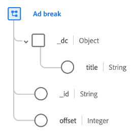

# [!UICONTROL Ad break] data type

[!UICONTROL Ad break] is a standard Experience Data Model (XDM) data type that describes how a timed ad is inserted into a timed piece of media.

| Property | Data type | Description |
| --- | --- | --- |
| `_dc.title` | String | A friendly name for the ad break. |
| `_id` | String | A unique identifier for the ad break. |
| `offset` | Integer | The offset, in seconds, of the ad break from the start of the primary content. |

{style="table-layout:auto"}

For more details on the data type, refer to the public XDM repository:

* [Populated example](https://github.com/adobe/xdm/blob/master/components/datatypes/marketing/advertising-break.example.1.json)
* [Full schema](https://github.com/adobe/xdm/blob/master/components/datatypes/marketing/advertising-break.schema.json)
