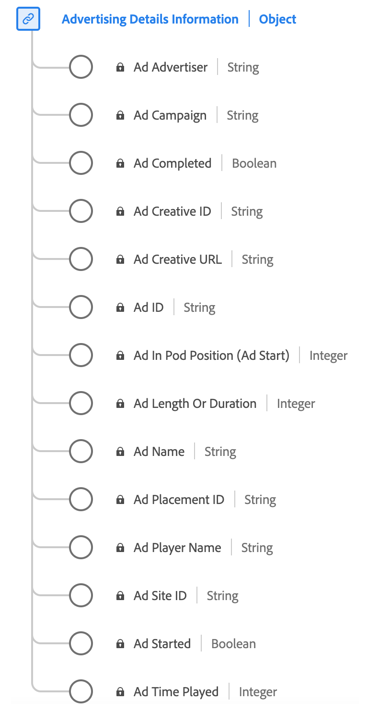

# [!UICONTROL Advertising Details] Reporting data type

[!UICONTROL Advertising Details] Reporting is a standard Experience Data Model (XDM) data type that captures key attributes related to advertisements. It includes information such as the ad ID, advertiser and campaign IDs, length, position within a sequence, details about the player rendering the ad, and so on. You can use this data type to track and analyze various aspects of ad performance and engagement, and provide insights into how audiences interact with and respond to different advertisements.

+++Select to display a diagram of the Advertising Details Reporting data type.

+++

>[!NOTE]
>
>This data type belongs to the `mediaReporting` schema — fields computed by the streaming media backend from `mediaCollection` data sent by your implementation. These are the fields that Adobe ingests into Platform datasets. See [Streaming media XDM reporting schema](https://experienceleague.adobe.com/en/docs/media-analytics/using/implementation/edge/reporting-schema) for details.

Each display name contains a link to further information on its reporting dimension or metric. The linked pages contain details on how Adobe computes and reports this data, including breakdowns by reporting system.

| Display name | Property | Data type | Description |
|---|---|---|---|
| [[!UICONTROL Ad Name]](https://experienceleague.adobe.com/en/docs/media-analytics/using/reporting/dimensions/ad-name) | `friendlyName` | string | The human readable name of the ad. |
| [[!UICONTROL Ad ID]](https://experienceleague.adobe.com/en/docs/media-analytics/using/reporting/dimensions/ad) | `name` | string | The ID of the ad. Any integer and/or letter combination. |
| [[!UICONTROL Ad Length Or Duration]](https://experienceleague.adobe.com/en/docs/media-analytics/using/reporting/dimensions/ad-length) | `length` | integer | The length of the ad in seconds. |
| [[!UICONTROL Ad In Pod Position (Ad Start)]](https://experienceleague.adobe.com/en/docs/media-analytics/using/reporting/dimensions/ad-in-pod-position) | `podPosition` | integer | The index of the ad inside the parent ad break start, for example, the first ad has index 0 and the second ad has index 1. |
| [[!UICONTROL Ad Player Name]](https://experienceleague.adobe.com/en/docs/media-analytics/using/reporting/dimensions/ad-player-name) | `playerName` | string | The name of the player responsible for rendering the ad. |
| [[!UICONTROL Ad Advertiser]](https://experienceleague.adobe.com/en/docs/media-analytics/using/reporting/dimensions/advertiser) | `advertiser` | string | The company or brand whose product is featured in the ad. |
| [[!UICONTROL Ad Campaign]](https://experienceleague.adobe.com/en/docs/media-analytics/using/reporting/dimensions/campaign-id) | `campaignID` | string | The ID of the ad campaign. |
| [[!UICONTROL Ad Creative ID]](https://experienceleague.adobe.com/en/docs/media-analytics/using/reporting/dimensions/creative-id) | `creativeID` | string | The ID of the ad creative. |
| [[!UICONTROL Ad Site ID]](https://experienceleague.adobe.com/en/docs/media-analytics/using/reporting/dimensions/site-id) | `siteID` | string | The ID of the ad site. |
| [[!UICONTROL Ad Creative URL]](https://experienceleague.adobe.com/en/docs/media-analytics/using/reporting/dimensions/creative-url) | `creativeURL` | string | The URL of the ad creative. |
| [[!UICONTROL Ad Placement ID]](https://experienceleague.adobe.com/en/docs/media-analytics/using/reporting/dimensions/placement-id) | `placementID` | string | The placement ID of the ad. |
| [[!UICONTROL Ad Completed]](https://experienceleague.adobe.com/en/docs/media-analytics/using/reporting/metrics/ad-completes) | `isCompleted` | boolean | Tracks whether the ad has completed. |
| [[!UICONTROL Ad Started]](https://experienceleague.adobe.com/en/docs/media-analytics/using/reporting/metrics/ad-starts) | `isStarted` | boolean | Tracks whether the ad has started. |
| [[!UICONTROL Ad Time Played]](https://experienceleague.adobe.com/en/docs/media-analytics/using/reporting/metrics/ad-time-spent) | `timePlayed` | integer | The total amount of time, in seconds, spent watching the ad (that is, the number of seconds played). |

See [advertisingdetails.schema.json](https://github.com/adobe/xdm/blob/master/components/datatypes/advertisingdetails.schema.json) in the public XDM repository for the full schema definition.
