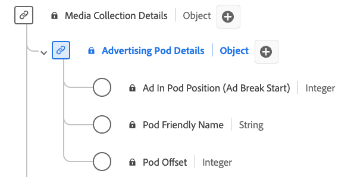

# [!UICONTROL Advertising Pod Details] Collection data type

[!UICONTROL Advertising Pod Details] Collection is a standard Experience Data Model (XDM) data type. It defines a sequence or group of ads typically played in succession during content breaks. Use the [!UICONTROL Advertising Pod Details] Collection data type to capture details such as the ad break ID, a friendly name for the ad break, the index of ads within the break, and the offset of the ad break within the content's timeline in seconds.

| Display name                            | Property        | Data type | Required | Description                                             |
|-----------------------------------------|-----------------|-----------|--------------------------------------------------------------------|
| [!UICONTROL Ad In Pod Position]         | `index`         | integer   |  Yes   | The index of the ad inside the parent ad break start.      |
| [!UICONTROL Pod Friendly Name]          | `friendlyName`  | string    |  No    | The easily understandable name of the ad break.           |
| [!UICONTROL Pod Offset]                 | `offset`        | integer   |  Yes   | The offset of the ad break inside the content, in seconds. |
