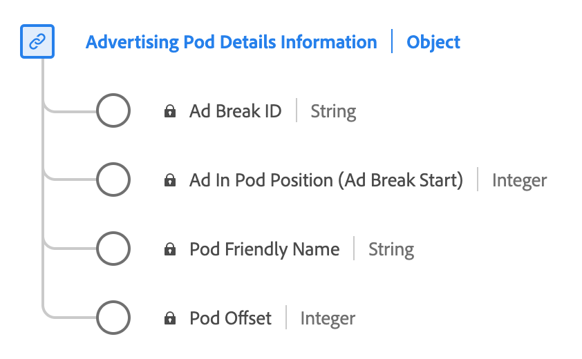

# [!UICONTROL Advertising Pod Details Reporting] data type

[!UICONTROL Advertising Pod Details Reporting] is a standard Experience Data Model (XDM) data type. It defines a sequence or group of ads typically played in succession during content breaks. Use the [!UICONTROL Advertising Pod Details Reporting] data type to capture details such as the ad break ID, a friendly name for the ad break, the index of ads within the break, and the offset of the ad break within the content's timeline in seconds.

| Display name               | Property               | Data type | Description                                           |
|----------------------------|------------------------|-----------|-------------------------------------------------------|
| [!UICONTROL Ad Break ID]                | `ID`               | string    | The ID of the ad break.                               |
| [!UICONTROL Pod Friendly Name]          | `friendlyName`      | string    | The easily understandable name of the ad break.                     |
| [!UICONTROL Ad In Pod Position]         | `index`         | integer   | The index of the ad inside the parent ad break start.  |
| [!UICONTROL Pod Offset]                 | `offset`           | integer   | **Required** The offset of the ad break inside the content, in seconds. |

{style="table-layout:auto"}

For more details on the field group, refer to the [public XDM repository](https://github.com/adobe/xdm/blob/master/components/datatypes/advertisingpoddetails.schema.json)
