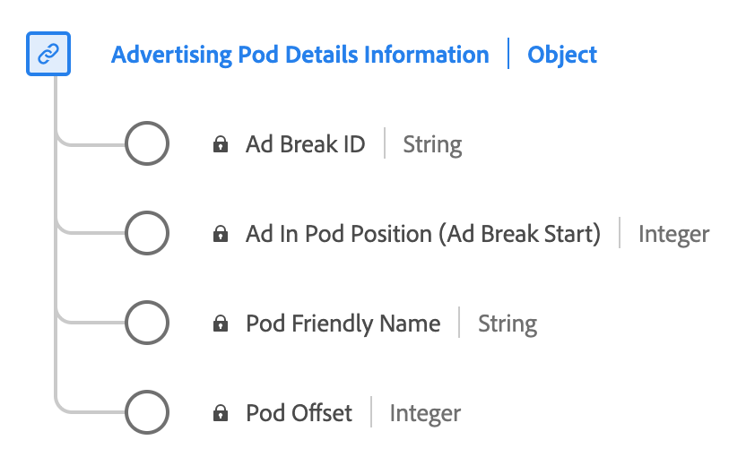

# [!UICONTROL Advertising Pod Details Reporting] data type

[!UICONTROL Advertising Pod Details Reporting] is a standard Experience Data Model (XDM) data type. It defines a sequence or group of ads typically played in succession during content breaks. Use the [!UICONTROL Advertising Pod Details Reporting] data type to capture details such as the ad break ID, a friendly name for the ad break, the index of ads within the break, and the offset of the ad break within the content's timeline in seconds.

+++Select to display a diagram of the [!UICONTROL Advertising Pod Details Reporting] data type.

+++

>[!NOTE]
>
>This data type belongs to the `mediaReporting` schema — fields computed by the streaming media backend from `mediaCollection` data sent by your implementation. These are the fields that Adobe ingests into Platform datasets. See [Streaming media XDM reporting schema](https://experienceleague.adobe.com/en/docs/media-analytics/using/implementation/edge/reporting-schema) for details.

Each display name contains a link to further information on its reporting dimension or metric. The linked pages contain details on how Adobe computes and reports this data, including breakdowns by reporting system.

| Display name | Property | Data type | Description |
|---|---|---|---|
| [!UICONTROL Ad Break ID] | `ID` | string | The ID of the ad break. |
| [[!UICONTROL Pod Friendly Name]](https://experienceleague.adobe.com/en/docs/media-analytics/using/reporting/dimensions/pod-name) | `friendlyName` | string | The easily understandable name of the ad break. |
| [[!UICONTROL Ad In Pod Position]](https://experienceleague.adobe.com/en/docs/media-analytics/using/reporting/dimensions/pod-position) | `index` | integer | The index of the ad inside the parent ad break start. |
| [!UICONTROL Pod Offset] | `offset` | integer | The offset of the ad break inside the content, in seconds. |

See [advertisingpoddetails.schema.json](https://github.com/adobe/xdm/blob/master/components/datatypes/advertisingpoddetails.schema.json) in the public XDM repository for the full schema definition.
