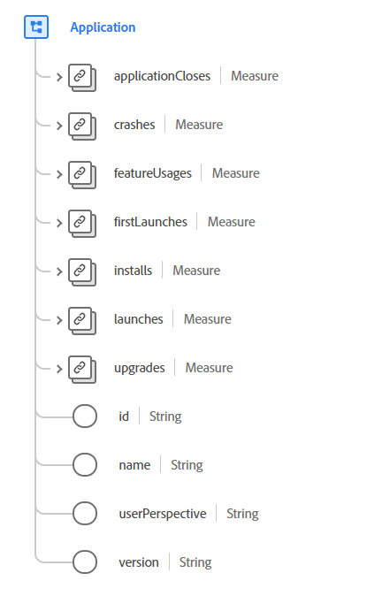

# [!UICONTROL Application] data type

[!UICONTROL Application] is a standard Experience Data Model (XDM) data type that describes details related to interactions generated by an application. An application refers to a software experience, such as a mobile or desktop application that can be installed, run, closed, or uninstalled by an end user. The properties for this data type are not intended to describe agents such as chatbots, browser-based plugins, or other experiences that do not apply to applications.

 

| Property | Data type | Description |
| --- | --- | --- |
| `applicationCloses` | [[!UICONTROL Measure]](./measure.md) | Describes details on the termination of an application. |
| `crashes` | [[!UICONTROL Measure]](./measure.md) | This property triggers when the application does not exit as intended. |
| `featureUsages` | [[!UICONTROL Measure]](./measure.md) | Describes any data from the activation of an application feature that being measured. |
| `firstLaunches` | [[!UICONTROL Measure]](./measure.md) | Contains data on the first launch. This property is triggered on first launch after an installation. |
| `installs` | [[!UICONTROL Measure]](./measure.md) | Records the installation of an application on a device when a specific installation event is available. |
| `launches` | [[!UICONTROL Measure]](./measure.md) | Describes a value associated with the launch of an application. This is triggered on every run, including crashes, installs, and resuming from background when the session timeout has been exceeded. |
| `upgrades` | [[!UICONTROL Measure]](./measure.md) | Contains data on the upgrade of an application that has previously been installed. This is triggered on the first launch after an upgrade. |
| `id` | String | A unique identifier for the application. |
| `name` | String | The name of the application. |
| `userPerspective` | String | The perspective or physical relationship between the user and the app or brand at the time an event happened. Understanding the perspective of the user in relation to the app helps with accurately generating sessions as the majority of the time you will not want to include `background` and `detached` events as part of an "active" session. The value of this property must be equal to one of the enum values listed below. <li> `foreground`: The user and app are directly interacting with one another. </li> <li> `background`: The app and user are indirectly interacting with one another. For example, the app could measure a value and refresh while the screen is locked or another app is being used in the foreground.  </li> <li> `detached`: Detached means the event was related to the app but didn't come directly from the app, such as the sending of an email or push notification from an external system. |
| `version` | String | The version of the application. |

{style="table-layout:auto"}

For more details on the data type, refer to the public XDM repository:

* [Populated example](https://github.com/adobe/xdm/blob/master/components/datatypes/channels/application.example.1.json)
* [Full schema](https://github.com/adobe/xdm/blob/master/components/datatypes/channels/application.schema.json)
