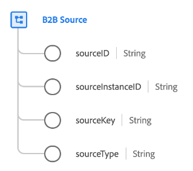

# [!UICONTROL B2B Source] data type

[!UICONTROL B2B Source] is a standard Experience Data Model (XDM) data type that represents a composite identifier for a B2B entity (such as an [account](../classes/b2b/business-account.md), an [opportunity](../classes/b2b/business-opportunity.md), or a [campaign](../classes/b2b/business-campaign.md)).

When relying solely on string-based identifiers, there can be overlaps between IDs across multiple systems (for example, an opportunity could be given a string ID on one CRM system, but that same ID could refer to a completely different opportunity). This can result in data conflicts when merging data in [Real-Time Customer Profile](../../profile/home.md).

The [!UICONTROL B2B Source] data type allows you to to use the original string ID of an entity and combine it with source-specific contextual information to ensure that it remains wholly unique in the Platform system regardless of the source it originated from.

| Property | Data type | Description |
| --- | --- | --- |
| `sourceID` | String | A unique ID for the source record. |
| `sourceInstanceID` | String | The instance or organization ID of the source data. |
| `sourceKey` | String | A unique identifier composed of the `sourceId`, `sourceInstanceId`, and `sourceType` concatenated together in the following format: `[sourceID]@[sourceInstanceID].[sourceType]`.  Some source connectors like Marketo concatenate this value automatically for certain identifiers. Others must be concatenated manually using the [Data Prep `concat` function](../../data-prep/functions.md#string), for example: `concat(id,"@${ORG_ID}.Marketo")` |
| `sourceType` | String | The name of the platform that provides the source data. |

{style="table-layout:auto"}

For more details on the data type, refer to the public XDM repository:

* [Populated example](https://github.com/adobe/xdm/blob/master/components/datatypes/b2b/b2b-source.example.1.json)
* [Full schema](https://github.com/adobe/xdm/blob/master/components/datatypes/b2b/b2b-source.schema.json)
