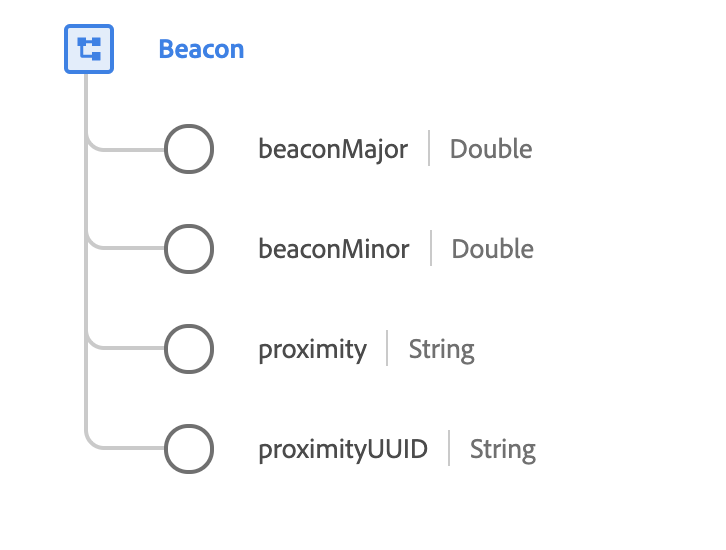

# [!UICONTROL Beacon] data type

[!UICONTROL Beacon] is a standard XDM data type that describes the wireless device that communicates identity information to mobile applications as mobile devices come within range.

 

| Property | Data type | Description |
| --- | --- | --- |
| `beaconMajor` | Double | Major values identify and distinguish a group and unsigned integer values between 1 and 65,535. |
| `beaconMinor` | Double | Minor values identify and distinguish an individual and unsigned integer values between 1 and 65,535. |
| `proximity` | String | Estimated distance from the beacon. See the [appendix](#proximity) for accepted values and definitions. |
| `proximityUUID` | String | A proximity UUID (Universally Unique Identifier) is a special type of identifier used to distinguish beacons in your network from all other beacons in networks outside your control. The proximity UUID is configured into a beacon, to be transmitted to mobile devices in range to identify an organization's beacons. |

{style="table-layout:auto"}

For more details on the data type, refer to the public XDM repository:

* [Populated example](https://github.com/adobe/xdm/blob/master/components/datatypes/deprecated/beacon-interaction-details.example.1.json)
* [Full schema](https://github.com/adobe/xdm/blob/master/components/datatypes/deprecated/beacon-interaction-details.schema.json)

## Appendix

The following section contains additional information about the [!UICONTROL Beacon] data type.

## Accepted values for proximity {#proximity}

The following table outlines the accepted values for `proximity` and their associated meanings:

| Value | Description |
| --- | --- |
| `immediate` | Within a few centimeters. |
| `near` | Less than 10 meters away. |
| `far` | Greater than 10 meters away. |
| `unknown` | The distance was not able to be ascertained, likely due to a weak signal. |
