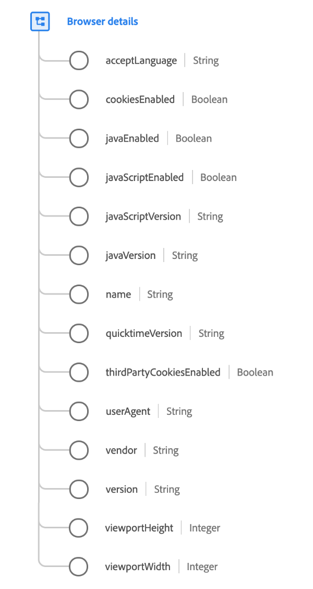

# [!UICONTROL Browser details] data type

[!UICONTROL Browser details] is a standard XDM data type that describes details relating to a browser or application.

 

| Property | Data type | Description |
| --- | --- | --- |
| `acceptLanguage` | String | An IETF language tag ([RFC 5646](https://tools.ietf.org/html/rfc5646)). |
| `cookiesEnabled` | Boolean | Indicates whether the user's settings allow for the writing of cookies. |
| `javaEnabled` | Boolean | Indicates whether Java was enabled in the device the observation was made from. |
| `javaScriptEnabled` | Boolean |  Indicates whether JavaScript was enabled in the device the observation was made from.  |
| `javaScriptVersion` | String | The version of JavaScript supported during the observation. |
| `javaVersion` | String | The version of Java supported during the observation. |
| `name` | String | The application or browser name. |
| `quicktimeVersion` | String | The version of Apple Quicktime supported during the observation. |
| `thirdPartyCookiesEnabled` | Boolean |  Indicates whether third-party cookies were enabled in the device the observation was made from. |
| `userAgent` | String | The HTTP user-agent string from the client request. |
| `vendor` | String | The application or browser vendor. |
| `version` | String | The application or browser version. |
| `viewportHeight` | Integer | The vertical size in pixels of the window the event was displayed inside. For a web-view event, this is the browser viewport height. |
| `viewportWidth` | Integer | The horizontal size in pixels of the window the event was displayed inside. For a web-view event, this is the browser viewport width. |

{style="table-layout:auto"}

For more details on the data type, refer to the public XDM repository:

* [Populated example](https://github.com/adobe/xdm/blob/master/components/datatypes/browserdetails.example.1.json)
* [Full schema](https://github.com/adobe/xdm/blob/master/components/datatypes/browserdetails.schema.json)
