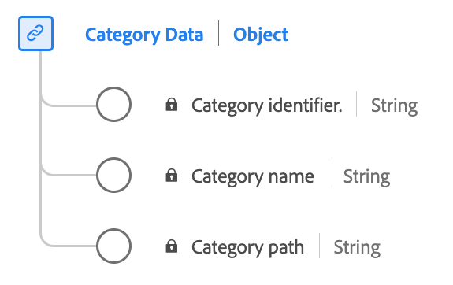

# [!UICONTROL Category data] data type

[!UICONTROL Category data] is a standard Experience Data Model (XDM) data type that describes information related to a product's category. 

| Display name    | Property           | Data type | Description                              |
|-----------------|--------------------|-----------|------------------------------------------|
| [!UICONTROL Category identifier] | `categoryID`   | string    | The identifier for the product's category.    |
| [!UICONTROL Category name]   | `categoryName`   | string    | The name of the product's category.          |
| [!UICONTROL Category path]   | `categoryPath`   | string    | The path of the product's category.          |

{style="table-layout:auto"}

For more details on the data type, refer to the public XDM repository:

* [Populated example](https://github.com/adobe/xdm/blob/master/components/datatypes/categorydata.example.1.json)
* [Full schema](https://github.com/adobe/xdm/blob/master/components/datatypes/categorydata.schema.json)
