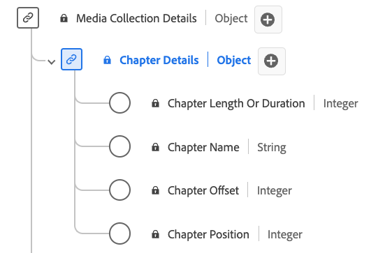

# [!UICONTROL Chapter Details] Collection data type

[!UICONTROL Chapter Details] Collection is a standard Experience Data Model (XDM) data type that describes various attributes related to chapters or segments within media content. Use the [!UICONTROL Chapter Details] Collection data type to capture details such as chapter name, offset, duration, and the chapter index. Media collection fields capture data and send it onto other Adobe services for further processing.

>[!NOTE]
>
>Each display name contains a link to further information on its audio and video parameters. The linked pages contain details on the video ad data collected by Adobe, implementation values, network parameters, reporting, and important considerations.

| Display name                                                                                                                                                            | Property      | Data type | Required | Description                                       | 
|-------------------------------------------------------------------------------------------------------------------------------------------------------------------------|---------------|-----------|----------|---------------------------------------------------|
| [[!UICONTROL Chapter Length Or Duration]](https://experienceleague.adobe.com/docs/media-analytics/using/implementation/variables/chapter-parameters.html#chapter-length)| `length`      | integer   |   Yes    | The length of the chapter, in seconds.            |
| [[!UICONTROL Chapter Name]](https://experienceleague.adobe.com/docs/media-analytics/using/implementation/variables/chapter-parameters.html#chapter-name)                | `friendlyName`| string    |   No     | The name of the chapter and/or segment.           |
| [[!UICONTROL Chapter Offset]](https://experienceleague.adobe.com/docs/media-analytics/using/implementation/variables/chapter-parameters.html#chapter-offset)            | `offset`      | integer   |   Yes    | The offset of the chapter inside the content (in seconds) from the start. |
| [[!UICONTROL Chapter Position]](https://experienceleague.adobe.com/docs/media-analytics/using/implementation/variables/chapter-parameters.html#chapter-position)        | `index`       | integer   |   Yes    | The position (index, integer) of the chapter inside the content. |

{style="table-layout:auto"}
