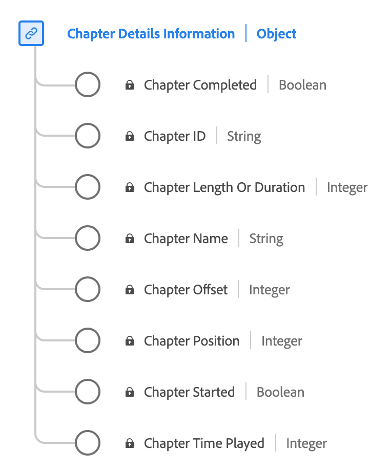

# [!UICONTROL Chapter Details Information] data type

[!UICONTROL Chapter Details Information] is a standard Experience Data Model (XDM) data type that describes various attributes related to chapters or segments within media content. Use the [!UICONTROL Chapter Details Information] data type to capture details such as chapter name, duration, position, ID, playback status (started/completed), and the time spent on each chapter.

| Display name              | Property      | Data type | Description                                       |
|---------------------------|---------------|-----------|---------------------------------------------------|
| [!UICONTROL Chapter Name]              | `friendlyName` | string    | The name of the chapter and/or segment.           |
| [!UICONTROL Chapter Length Or Duration]| `length`       | integer   | **Required** The length of the chapter, in seconds.            |
| [!UICONTROL Chapter Offset]            | `offset`      | integer   | **Required** The offset of the chapter inside the content (in seconds) from the start. |
| [!UICONTROL Chapter Position]          | `index`       | integer   | **Required** The position (index, integer) of the chapter inside the content. |
| [!UICONTROL Chapter ID]                | `ID`          | string    | The auto-generated ID of the chapter.             |
| [!UICONTROL Chapter Started]           | `isStarted`   | boolean   | Whether the chapter has started.                  |
| [!UICONTROL Chapter Completed]         | `isCompleted` | boolean   | Whether the chapter has completed.                |
| [!UICONTROL Chapter Time Played ]      | `timePlayed`  | integer   | The time spent on the chapter, in seconds.        |

{style="table-layout:auto"}

For more details on the field group, refer to the [public XDM repository](https://github.com/adobe/xdm/blob/master/components/datatypes/chapterdetails.schema.json)
