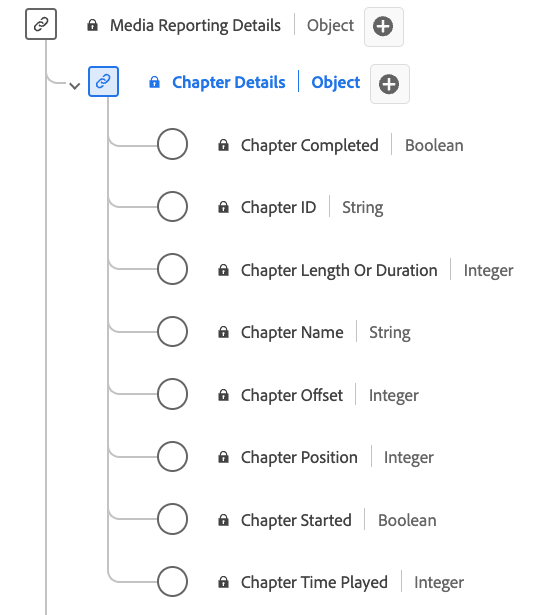

# [!UICONTROL Chapter Details] Reporting data type

[!UICONTROL Chapter Details] Reporting is a standard Experience Data Model (XDM) data type that describes various attributes related to chapters or segments within media content. Use the [!UICONTROL Chapter Details] Reporting data type to capture details such as chapter name, duration, position, ID, playback status (started/completed), and the time spent on each chapter. Media reporting fields are used by Adobe services to analyze the Media Collection fields sent by users. This data, alongside other specific user metrics, are computed and reported upon.

>[!NOTE]
>
>Each display name contains a link to further information on its audio and video parameters. The linked pages contain details on the video ad data collected by Adobe, implementation values, network parameters, reporting, and important considerations.

| Display name                                                                                                                                                            | Property      | Data type |           Description                                       | 
|-------------------------------------------------------------------------------------------------------------------------------------------------------------------------|---------------|-----------|--------------------------------------------------------------|
| [[!UICONTROL Chapter Completed]](https://experienceleague.adobe.com/docs/media-analytics/using/implementation/variables/chapter-parameters.html#chapter-complete)       | `isCompleted` | boolean   | Whether the chapter has completed or not.                |
| [[!UICONTROL Chapter ID]](https://experienceleague.adobe.com/docs/media-analytics/using/implementation/variables/chapter-parameters.html#chapter)                       | `ID`          | string    | The auto-generated ID of the chapter.             |
| [[!UICONTROL Chapter Length Or Duration]](https://experienceleague.adobe.com/docs/media-analytics/using/implementation/variables/chapter-parameters.html#chapter-length)| `length`      | integer   | The length of the chapter, in seconds.            |
| [[!UICONTROL Chapter Name]](https://experienceleague.adobe.com/docs/media-analytics/using/implementation/variables/chapter-parameters.html#chapter-name)                | `friendlyName`| string    | The name of the chapter and/or segment.           |
| [[!UICONTROL Chapter Offset]](https://experienceleague.adobe.com/docs/media-analytics/using/implementation/variables/chapter-parameters.html#chapter-offset)            | `offset`      | integer   | The offset of the chapter inside the content (in seconds) from the start. |
| [[!UICONTROL Chapter Position]](https://experienceleague.adobe.com/docs/media-analytics/using/implementation/variables/chapter-parameters.html#chapter-position)        | `index`       | integer   | The position (index, integer) of the chapter inside the content. |
| [[!UICONTROL Chapter Started]](https://experienceleague.adobe.com/docs/media-analytics/using/implementation/variables/chapter-parameters.html#chapter-start)            | `isStarted`   | boolean   | Whether the chapter has started or not.                  |
| [[!UICONTROL Chapter Time Played]](https://experienceleague.adobe.com/docs/media-analytics/using/implementation/variables/chapter-parameters.html#chapter-time-spent)   | `timePlayed`  | integer   | The time spent on the chapter, in seconds.        |
