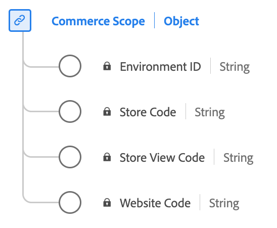

# [!UICONTROL Commerce Scope] data type

[!UICONTROL Commerce Scope] is a standard Experience Data Model (XDM) data type that defines identifiers for where an event occurred within a commerce ecosystem. It distinguishes environments, websites, stores, and store views.

| Display name                    | Property            | Data type | Description                                           |
|---------------------------------|-------------------|-----------|-------------------------------------------------------|
| [!UICONTROL Environment ID]     | `environmentID`   | string    | The environment ID. A 32-digit alphanumeric ID.        |
| [!UICONTROL Website Code]       | `websiteCode`     | string    | The unique website code within an environment.              |
| [!UICONTROL Store Code]         | `storeCode`       | string    | The unique store code within a website.                    |
| [!UICONTROL Store View Code]    | `storeViewCode`   | string    | The unique store view code within a store.                 |

{style="table-layout:auto"}

For more details on the data type, refer to the public XDM repository:

* [Populated example](https://github.com/adobe/xdm/blob/master/components/datatypes/commercescope.example.1.json)
* [Full schema](https://github.com/adobe/xdm/blob/master/components/datatypes/commercescope.schema.json)
