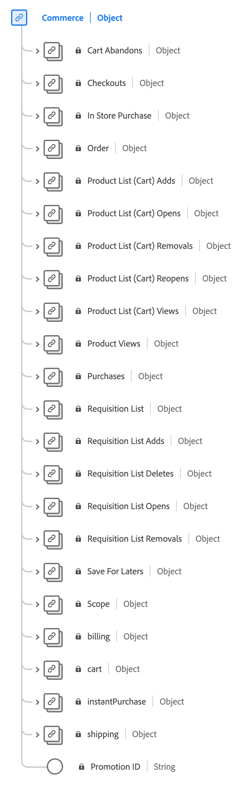

# [!UICONTROL Commerce] data type

[!UICONTROL Commerce] is a standard Experience Data Model (XDM) data type that describes the records related to buying and selling activity.

 

| Property | Data type | Description |
| --- | --- | --- |
| `order` | [[!UICONTROL Order]](./order.md) | Describes the placed order for one or more products. |
| `cartAbandons` | [[!UICONTROL Measure]](./measure.md) | Used to describe when a product list has been identified as no longer accessible or purchasable by the user. |
| `checkouts` | [[!UICONTROL Measure]](./measure.md) | An action during the checkout process of a product list. There can be more than one checkout event if there are multiple steps in a checkout process. If there are multiple steps, the event time information and referenced page or experience is used to identify the step and individual events represented in order. |
| `inStorePurchase` | [[!UICONTROL Measure]](./measure.md) | Describes a value associated with an in-store purchase for analytics use. |
| `productListAdds` | [[!UICONTROL Measure]](./measure.md) | The addition of a product to the product list, such as a product being added to a shopping cart. |
| `productListOpens` | [[!UICONTROL Measure]](./measure.md) | The initializations of a new product list, such as a shopping cart being created. |
| `productListRemovals` | [[!UICONTROL Measure]](./measure.md) | The removal or removals of a product entry from a product list, such as a product being removed from a shopping cart. |
| `productListReopens` | [[!UICONTROL Measure]](./measure.md) | A product list that was previously abandoned that has been re-activated by the user. |
| `productListViews` | [[!UICONTROL Measure]](./measure.md) | Describes when a view or views of a product list has occurred. |
| `productViews` | [[!UICONTROL Measure]](./measure.md) | Describes when a view or views of an individual product has occurred. |
| `purchases` | [[!UICONTROL Measure]](./measure.md) | Used to track when an order has been accepted. The purchase event is the only required action in a commerce conversion. The purchase event must have a product list referenced. |
| `saveForLaters` | [[!UICONTROL Measure]](./measure.md) | A product list is saved for future use such as a wish list. |

{style="table-layout:auto"}

For more details on the data type, refer to the public XDM repository:

* [Populated example](https://github.com/adobe/xdm/blob/master/components/datatypes/marketing/commerce.example.1.json)
* [Full schema](https://github.com/adobe/xdm/blob/master/components/datatypes/marketing/commerce.schema.json)
