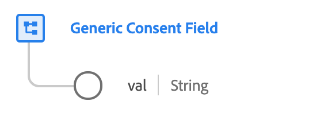

# [!UICONTROL Generic Consent Field] data type

[!UICONTROL Generic Consent Field] is a standard XDM data type that describes a customer's selection for a particular consent preference.

>[!NOTE]
>
>This data type is intended to be used to customize the structure of your organization's consent schemas using the [[!UICONTROL Consents and Preferences] field group](../field-groups/profile/consents.md) as a baseline.

| Property | Data type | Description |
| --- | --- | --- |
| `val` | String | The customer-provided consent choice for this use case. See the table below for accepted values and definitions. |

{style="table-layout:auto"}

The following table outlines the accepted values for `val`:

| Value | Title|  Description |
| --- | --- | --- |
| `y` | Yes (opt-in) | The customer has opted in for the consent. In other words, they **do** consent to the use of their data as indicated by the consent in question. |
| `n` | No (opt-out) | The customer has opted out of the consent. In other words, they **do not** consent to the use of their data as indicated by the consent in question. |
| `p` | Pending verification  | The system has not yet received a final consent value. This is most often used as part of a consent that requires two-step verification. For example, if a customer opts into receiving emails, that consent is set to `p` until they select a link in an email to verify that they have provided the correct email address, at which point the consent would be updated to `y`.  If this consent does not use a two-set verification process, then the `p` choice may instead be used to indicate that the customer has not yet responded to the consent prompt. For example, you can automatically set the value to `p` on the first page of a website, before the customer has responded to the consent prompt. In jurisdictions that do not require explicit consent, you may also use it to indicate that the customer has not explicitly opted out (in other words, consent is assumed). |
| `u` | Unknown | The customer's consent information is unknown. |
| `dy` | Default of Yes (opt-in) | The customer has not provided a consent value themselves, and is treated as an opt-in ("Yes") by default. In other words, consent is assumed until the customer indicates otherwise.  Note that if laws or changes to your company's privacy policy result in changes to the defaults of some or all users, you must manually update all profiles containing default values. |
| `dn` | Default of No (opt-out) | The customer has not provided a consent value themselves, and is treated as an opt-out ("No") by default. In other words, the customer is assumed to have denied consent until they indicate otherwise.  Note that if laws or changes to your company's privacy policy result in changes to the defaults of some or all users, you must manually update all profiles containing default values. |
| `LI` | Legitimate Interest | The legitimate business interest to collect and process this data for the specified purpose outweighs the potential harm it poses to the individual. |
| `CT` | Contract | The collection of data for the specified purpose is required to meet contractual obligations with the individual. |
| `CP` | Compliance with a Legal Obligation | The collection of data for the specified purpose is required to meet the legal obligations of the business. |
| `VI` | Vital Interest of the Individual | The collection of data for the specified purpose is required to protect the vital interests of the individual. |
| `PI` | Public Interest | The collection of data for the specified purpose is required to carry out a task in the public interest or in the exercise of official authority. |

{style="table-layout:auto"}

For more details on the data type, refer to the public XDM repository:

* [Populated example](https://github.com/adobe/xdm/blob/master/components/datatypes/consent/consent-field.example.1.json)
* [Full schema](https://github.com/adobe/xdm/blob/master/components/datatypes/consent/consent-field.schema.json)
