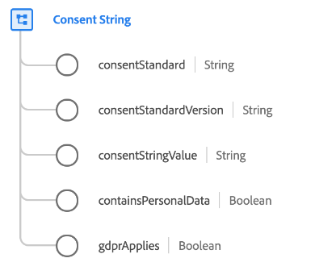

# [!UICONTROL Consent String] data type

[!UICONTROL Consent String] is a standard XDM data type that describes a string value that represents a customer's consent. It includes contextual information such as the standard for the consent string (for example, the [IAB Transparency and Consent Framework (TCF) 2.0](../field-groups/profile/iab.md)).

| Property | Data type | Description |
| --- | --- | --- |
| `consentStandard` | String | The standard for the consent string. This helps determine the format of the consent string as set by consent management services. |
| `consentStandardVersion` | String | The version of the consent standard, used to accurately define the format of the consent string as set by consent management services. |
| `consentStringValue` | String | The full consent string as provided by the consent management service. `consentStandard` and `consentStandardVersion` help define how to parse this string. |
| `containsPersonalData` | Boolean | When this field is true, it means this consent string needs to be processed for consent enforcement. |
| `gdprApplies` | Boolean | When this field is true, it means consent is coming with personal data. |

{style="table-layout:auto"}

For more details on the data type, refer to the public XDM repository:

* [Populated example](https://github.com/adobe/xdm/blob/master/components/datatypes/consent/consentstring.example.1.json)
* [Full schema](https://github.com/adobe/xdm/blob/master/components/datatypes/consent/consentstring.schema.json)
