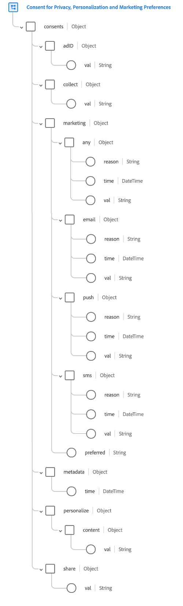

# [!UICONTROL Consents and Preferences] data type

The [!UICONTROL Consent for Privacy, Personalization and Marketing Preferences] data type (hereinafter referred to as the "[!UICONTROL Consents and Preferences] data type") is an [!DNL Experience Data Model] (XDM) data type that is intended to support the collection of customer permissions and preferences generated by Consent Management Platforms (CMPs) and other sources from your data operations. 

This document covers the structure and intended use of the fields provided by the [!UICONTROL Consents and Preferences] data type.

## Prerequisites {#prerequisites}

This document requires a working understanding of XDM and the use of the schemas in [!DNL Experience Platform]. Please review the following documentation before continuing:

* [XDM System overview](https://www.adobe.com/go/xdm-home-en)
* [Basics of schema composition](https://www.adobe.com/go/xdm-schema-best-practices-en)

## Data type structure {#structure}

>[!IMPORTANT]
>
>The [!UICONTROL Consents and Preferences] data type is designed to cover a range of consent and preference management use cases. As a result, this document describes the use of the data type's fields in general terms, and only makes suggestions as to how you should interpret the use of these fields. Please consult with your privacy legal team to align the data type's structure with how your organization interprets and presents these consent and preference choices to your customers.

The [!UICONTROL Consents and Preferences] data type provides several fields used to capture **consent** and **preference** information.

A consent is an option that allows a customer to specify how their data may be used. Most consents have a legal aspect, in that some jurisdictions require obtaining permission before data can be used in a particular way, or require that the customer has an option to stop that use (opt out) if affirmative consent is not required.

A preference is an option that allows the customer to specify how different aspects of their experience with a brand should be handled. These fall within two categories:

* **Personalization preferences**: Preferences regarding how the brand should personalize experiences delivered to a customer.
* **Marketing preferences**: Preferences regarding whether a brand is allowed to contact a customer through various channels.

The following screenshot shows how the structure of the data type is represented in the Platform UI:



>[!TIP]
>
>See the guide on [exploring XDM resources](../ui/explore.md) to for steps on how to look up any XDM resource and inspect its structure in the Platform UI.

The following JSON shows an example of the type of data that the [!UICONTROL Consents and Preferences] data type can process. Information on the specific use of each of these fields is provided in the sections that follow.

```json
{
  "consents": {
    "collect": {
      "val": "VI",
    },
    "adID": {
      "idType": "IDFA",
      "val": "y"
    },
    "share": {
      "val": "y",
    },
    "personalize": {
      "content": {
        "val": "y"
      }
    },
    "marketing": {
      "preferred": "email",
      "any": {
        "val": "u"
      },
      "push": {
        "val": "n",
        "reason": "Too Frequent",
        "time": "2019-01-01T15:52:25+00:00"
      }
    },
    "metadata": {
      "time": "2019-01-01T15:52:25+00:00"
    }
  }
}
```

>[!TIP]
>
>You can generate sample JSON data for any XDM schema that you define in Experience Platform in order to help visualize how your customer consent and preference data should be mapped. See the following documentation for more information:
>
>* [Generate sample data in the UI](../ui/sample.md)
>* [Generate sample data in the API](../api/sample-data.md)

## `consents` {#choices}

`consents` contains several fields that describe a customer's consents and preferences. These fields are described in further detail in the subsections below.

```json
"consents": {
  "collect": {
    "val": "VI",
  },
  "adID": {
    "idType": "IDFA",
    "val": "y"
  },
  "share": {
    "val": "y",
  },
  "personalize": {
    "content": {
      "val": "y"
    }
  },
  "marketing": {
    "preferred": "email",
    "any": {
      "val": "u"
    },
    "email": {
      "val": "n",
      "reason": "Too Frequent",
      "time": "2019-01-01T15:52:25+00:00"
    }
  }
}
```

### `collect`

`collect` represents the customer's consent for having their data collected.

```json
"collect": {
  "val": "y"
}
```

| Property | Description |
| --- | --- |
| `val` | The customer-provided consent choice for this use case. See the [appendix](#choice-values) for accepted values and definitions. |

{style="table-layout:auto"}

### `adID`

`adID` represents the customer's consent for whether an advertiser ID can be used to link the customer across apps on this device.

```json
"adID": {
  "idType": "IDFA",
  "val": "y"
}
```

| Property | Description |
| --- | --- |
| `idType` | The ad ID type, either `IDFA` for Apple's ID for Advertisers or `GAID` for Google's Advertiser ID, also known as Android Advertiser ID (AAID). |
| `val` | The customer-provided consent choice for this use case. See the [appendix](#choice-values) for accepted values and definitions. |

{style="table-layout:auto"}

### `share`

`share` represents the customer's consent for whether their data can be shared with (or sold to) second or third parties.

```json
"share": {
  "val": "y"
}
```

| Property | Description |
| --- | --- |
| `val` | The customer-provided consent choice for this use case. See the [appendix](#choice-values) for accepted values and definitions. |

{style="table-layout:auto"}

### `personalize` {#personalize}

`personalize` captures customer preferences regarding which ways their data can be used for personalization. Customers can opt out of specific personalization use cases, or opt out of personalization entirely.

>[!IMPORTANT]
>
>`personalize` does not cover marketing use cases. For example, if a customer opts out of personalization for all channels, they should not stop receiving communications through those channels. Rather, the messages they receive should be generic and not based on their profile.
>
>By the same example, if a customer opts out of direct marketing for all channels (through `marketing`, explained in the [next section](#marketing)), then that customer should not receive any messages, even if personalization is permitted.

```json
"personalize": {
  "content": {
    "val": "y",
  }
}
```

| Property | Description |
| --- | --- |
| `content` | Represents the customer's preferences for personalized content on your website or application. |
| `val` | The customer-provided personalization preference for the specified use case. In cases where the customer does not have to be prompted to provide consent, the value of this field should indicate the basis on which personalization should take place. See the [appendix](#choice-values) for accepted values and definitions. |

{style="table-layout:auto"}

### `marketing` {#marketing}

`marketing` captures customer preferences regarding what marketing purposes their data can be used for. Customers can opt out of specific marketing use cases, or opt out of direct marketing entirely.

```json
"marketing": {
  "preferred": "email",
  "any": {
    "val": "u"
  },
  "email": {
    "val": "n",
    "reason": "Too Frequent"
  },
  "push": {
    "val": "y"
  },
  "sms": {
    "val": "y"
  }
}
```

| Property | Description |
| --- | --- |
| `preferred` | Indicates the customer's preferred channel for receiving communications. See the [appendix](#preferred-values) for accepted values. |
| `any` |  Represents the customer's preferences for direct marketing as a whole. The consent preference provided in this field is considered the "default" preference for any marketing channel, unless overridden by additional sub-fields provided under `marketing`. If you plan on using more granular consent options, it is recommended that you exclude this field.<br><br>If the value is set to `n`, then all more specific personalization settings should be ignored. If the value is set to `y`, then all finer-grained personalization options should also be treated as `y`, unless explicitly set to `n`. If the value is unset, then the values for each personalization option should be honored as specified. |
| `email` | Indicates whether the customer agrees to receive email messages. | 
| `push` | Indicates whether the customer permits receiving push notifications. | 
| `sms` | Indicates whether the customer agrees to receive text messages. | 
| `val` | The customer-provided preference for the specified use case. In cases where the customer does not have to be prompted to provide consent, the value of this field should indicate the basis on which the marketing use case should take place. See the [appendix](#choice-values) for accepted values and definitions. |
| `time` | An ISO 8601 timestamp of when the marketing preference changed, if applicable. Note that if the timestamp for any individual preference is the same as the one provided under `metadata`, then this field does not to be set for that preference. |
| `reason` | When a customer opts out of a marketing use case, this string field represents the reason why the customer opted out. |

{style="table-layout:auto"}

### `metadata`

`metadata` captures general metadata about the customer's consents and preferences whenever they were last updated.

```json
"metadata": {
  "time": "2019-01-01T15:52:25+00:00",
}
```

| Property | Description |
| --- | --- |
| `time` | An ISO 8601 timestamp for the last time any of the customer's consents and preferences were updated. This field can be used instead of applying timestamps to individual preferences in order to reduce load and complexity. Providing an `time` value under an individual preference overrides the `metadata` timestamp for that particular preference. |

{style="table-layout:auto"}

## Ingesting data using the data type {#ingest}

In order to use the [!UICONTROL Consents and Preferences] data type to ingest consent data from your customers, you must create a dataset based on a schema that contains that data type.

See the tutorial on [creating a schema in the UI](https://www.adobe.com/go/xdm-schema-editor-tutorial-en) for steps on how to assign data types to fields. Once you have created a schema containing a field with the [!UICONTROL Consents and Preferences] data type, refer to the section on [creating a dataset](../../catalog/datasets/user-guide.md#create) in the dataset user guide, following the steps to create a dataset with an existing schema.

>[!IMPORTANT]
>
>If you want to send consent data to [!DNL Real-Time Customer Profile], it is required that you create a [!DNL Profile]-enabled schema based on the [!DNL XDM Individual Profile] class that contains the [!UICONTROL Consents and Preferences] data type. The dataset that you create based on that schema must also be enabled for [!DNL Profile]. Refer to the tutorials linked above for specific steps related to [!DNL Real-Time Customer Profile] requirements for schemas and datasets.
>
>In addition, you must also ensure that your merge policies are configured to prioritize the dataset(s) that contain the latest consent and preference data, in order for customer profiles to be updated correctly. See the overview on [merge policies](../../rtcdp/profile/merge-policies.md) for more information.

## Handling consent and preference changes

When a customer changes their consents or preferences on your website, these changes should be collected and immediately enforced using the [Adobe Experience Platform Web SDK](../../edge/consent/supporting-consent.md). If a customer opts out of data collection, all data collection must immediately cease. If a customer opts out of personalization, then there should be no personalization present on the next page they visit. 

## Appendix {#appendix}

The sections below provide additional reference information regarding the [!UICONTROL Consents and Preferences] data type.

### Accepted values for `val` {#choice-values}

The following table outlines the accepted values for `val`:

| Value | Title|  Description |
| --- | --- | --- |
| `y` | Yes (opt-in) | The customer has opted in for the consent or preference. In other words, they **do** consent to the use of their data as indicated by the consent or preference in question. |
| `n` | No (opt-out) | The customer has opted out of the consent or preference. In other words, they **do not** consent to the use of their data as indicated by the consent or preference in question. |
| `p` | Pending verification  | The system has not yet received a final consent or preference value. This is most often used as part of a consent that requires two-step verification. For example, if a customer opts into receiving emails, that consent is set to `p` until they select a link in an email to verify that they have provided the correct email address, at which point the consent would be updated to `y`.<br><br>If this consent or preference does not use a two-set verification process, then the `p` choice may instead be used to indicate that the customer has not yet responded to the consent prompt. For example, you can automatically set the value to `p` on the first page of a website, before the customer has responded to the consent prompt. In jurisdictions that do not require explicit consent, you may also use it to indicate that the customer has not explicitly opted out (in other words, consent is assumed). |
| `u` | Unknown | The customer's consent or preference information is unknown. |
| `dy` | Default of Yes (opt-in) | The customer has not provided a consent value themselves, and is treated as an opt-in ("Yes") by default. In other words, consent is assumed until the customer indicates otherwise.<br><br>Note that if laws or changes to your company's privacy policy result in changes to the defaults of some or all users, you must manually update all profiles containing default values. |
| `dn` | Default of No (opt-out) | The customer has not provided a consent value themselves, and is treated as an opt-out ("No") by default. In other words, the customer is assumed to have denied consent until they indicate otherwise.<br><br>Note that if laws or changes to your company's privacy policy result in changes to the defaults of some or all users, you must manually update all profiles containing default values. |
| `LI` | Legitimate Interest | The legitimate business interest to collect and process this data for the specified purpose outweighs the potential harm it poses to the individual. |
| `CT` | Contract | The collection of data for the specified purpose is required to meet contractual obligations with the individual. |
| `CP` | Compliance with a Legal Obligation | The collection of data for the specified purpose is required to meet the legal obligations of the business. |
| `VI` | Vital Interest of the Individual | The collection of data for the specified purpose is required to protect the vital interests of the individual. |
| `PI` | Public Interest | The collection of data for the specified purpose is required to carry out a task in the public interest or in the exercise of official authority. |

{style="table-layout:auto"}

### Accepted values for `preferred` {#preferred-values}

The following table outlines the accepted values for `preferred`. The `preferred` values indicate the customer's preferred channel for receiving communications that would inform them about data collection, privacy policies, and personalization options. 

| Value | Description |
| --- | --- |
| `email` | This preference indicates the customer's consent to receive messages via email. |
| `push` | This preference indicates the customer's consent to receive push notifications. These are messages or alerts sent directly to their device, often a mobile application. |
| `inApp` | This preference indicates the customer's consent to receive in-app messages. These messages are delivered within a mobile or web application and provide information while the user is actively engaged with the app. |
| `sms` | This preference indicates the customer's consent to receive messages via SMS (Short Message Service). These are text messages sent to their mobile phone. |
| `phone` | This preference indicates the customer's consent to receive communications through phone call interactions.  |
| `phyMail` | This preference indicates the customer's consent to receive materials through physical mail.  |
| `inVehicle` | This preference indicates the customer's consent to receive notifications while in their vehicle. These messages may be delivered through vehicle infotainment systems or other in-vehicle communication channels. |
| `inHome` | This preference indicates the customer's consent to receive messages while at home. These messages may be delivered through smart home devices or other home-based communication channels. |
| `iot` | This preference denotes the customer's consent to receive messages related to the Internet of Things (IoT). These messages may be delivered through connected devices and systems within their environment. |
| `social` | This preference indicates the customer's consent to receive communications through social media platforms.  |
| `other` | This preference encompasses channels that do not fit into standard categories. It represents alternative or specialized communication channels that may be specific to a particular business or industry. |
| `none` | This preference indicates that the customer does not have a preferred communication channel. |
| `unknown` | This preference signifies that the customer's preferred communication channel is not known or has not been specified. This could occur if the customer has not provided explicit consent or preference information. |

{style="table-layout:auto"}

### Full [!UICONTROL Consents and Preferences] schema {#full-schema}

To view the full schema for the [!UICONTROL Consents and Preferences] data type, refer to the [official XDM repository](https://github.com/adobe/xdm/blob/master/components/datatypes/consent/consent-preferences.schema.json).
