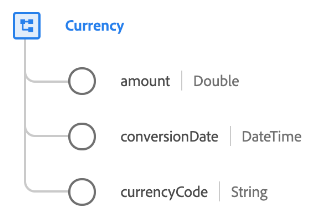

# [!UICONTROL Currency] data type

[!UICONTROL Currency] is a standard XDM data type that describes an amount of currency, including the currency type and conversion date.

| Property | Data type | Description |
| --- | --- | --- |
| `amount` | Double | The amount of currency as defined by the `currencyCode`. |
| `conversionDate` | DateTime | A timestamp of when the currency conversion was made. |
| `currencyCode` | String | An ISO 4217 code indicating the type of currency that `amount` represents. |

{style="table-layout:auto"}

For more details on the field group, refer to the public XDM repository:

* [Populated example](https://github.com/adobe/xdm/blob/master/components/datatypes/currency.example.1.json)
* [Full schema](https://github.com/adobe/xdm/blob/master/components/datatypes/currency.schema.json)
