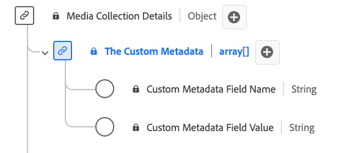

# [!UICONTROL Custom Metadata Details] Collection data type

[!UICONTROL Custom Metadata Details] Collection is a standard Experience Data Model (XDM) data type defines a structure for storing custom metadata. Use the [!UICONTROL Custom Metadata Details] Collection data type to capture details such as the name and value of custom metadata associated with content or interactions.

| Display name                               | Property         | Data type | Required | Description                             |
|--------------------------------------------|------------------|-----------|----------|-------------------------------|
| [!UICONTROL Custom Metadata Field Name]    | `name`           | string    |    No    | The name of the custom field.           |
| [!UICONTROL Custom Metadata Field Value]   | `value`          | string    |    No    | The value of the custom field.          |

{style="table-layout:auto"}
