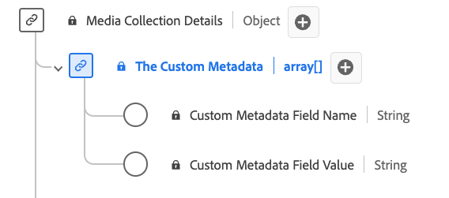

# [!UICONTROL Custom Metadata Details] Collection data type

[!UICONTROL Custom Metadata Details] Collection is a standard Experience Data Model (XDM) data type that defines a structure for storing custom metadata. Use the [!UICONTROL Custom Metadata Details] Collection data type to capture details such as the name and value of custom metadata associated with content or interactions.

+++Select to display a diagram of the [!UICONTROL Custom Metadata Details] Collection data type.

+++

>[!NOTE]
>
>This data type belongs to the `mediaCollection` schema — fields that your implementation sends to the streaming media backend. Adobe processes this data and produces the corresponding `mediaReporting` fields, which are ingested into Platform datasets. See [Streaming media XDM reporting schema](https://experienceleague.adobe.com/en/docs/media-analytics/using/implementation/edge/reporting-schema) for details.

| Display name | Property | Data type | Required | Description |
|---|---|---|---|---|
| [!UICONTROL Custom Metadata Field Name] | `name` | string | No | The name of the custom field. |
| [!UICONTROL Custom Metadata Field Value] | `value` | string | No | The value of the custom field. |
