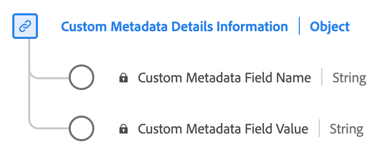

# [!UICONTROL Custom Metadata Details Information] data type

[!UICONTROL Custom Metadata Details Information] is a standard Experience Data Model (XDM) data type defines a structure for storing custom metadata. Use the [!UICONTROL Custom Metadata Details Information] data type to capture details such as the name and value of custom metadata associated with content or interactions.

| Display name                               | Property         | Data type | Description                             |
|--------------------------------------------|------------------|-----------|-----------------------------------------|
| [!UICONTROL Custom Metadata Field Name]    | `name`           | string    | The name of the custom field.           |
| [!UICONTROL Custom Metadata Field Value]   | `value`          | string    | The value of the custom field.          |

{style="table-layout:auto"}

For more details on the field group, refer to the [public XDM repository](https://github.com/adobe/xdm/blob/master/components/datatypes/custommetadatadetails.schema.json)
