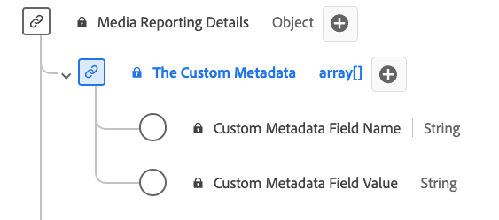

# [!UICONTROL Custom Metadata Details] Reporting data type

[!UICONTROL Custom Metadata Details] Reporting is a standard Experience Data Model (XDM) data type defines a structure for storing custom metadata. The [!UICONTROL Custom Metadata Details] Reporting data type captures details such as the name and value of custom metadata associated with content or interactions. Media reporting fields are used by Adobe services to analyze the media collection fields sent by users. This data, alongside other specific user metrics, are computed and reported upon.

| Display name                               | Property         | Data type | Description                             |
|--------------------------------------------|------------------|-----------|-----------------------------------------|
| [!UICONTROL Custom Metadata Field Name]    | `name`           | string    | The name of the custom field.           |
| [!UICONTROL Custom Metadata Field Value]   | `value`          | string    | The value of the custom field.          |

{style="table-layout:auto"}
