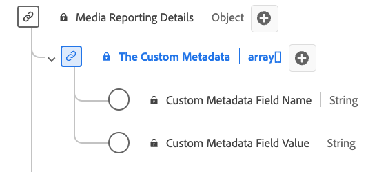

# [!UICONTROL Custom Metadata Details] Reporting data type

[!UICONTROL Custom Metadata Details] Reporting is a standard Experience Data Model (XDM) data type that defines a structure for storing custom metadata. The [!UICONTROL Custom Metadata Details] Reporting data type captures details such as the name and value of custom metadata associated with content or interactions.

+++Select to display a diagram of the [!UICONTROL Custom Metadata Details] Reporting data type.

+++

>[!NOTE]
>
>This data type belongs to the `mediaReporting` schema — fields computed by the streaming media backend from `mediaCollection` data sent by your implementation. These are the fields that Adobe ingests into Platform datasets. See [Streaming media XDM reporting schema](https://experienceleague.adobe.com/en/docs/media-analytics/using/implementation/edge/reporting-schema) for details.

| Display name | Property | Data type | Description |
|---|---|---|---|
| [!UICONTROL Custom Metadata Field Name] | `name` | string | The name of the custom field. |
| [!UICONTROL Custom Metadata Field Value] | `value` | string | The value of the custom field. |

See [custommetadatadetails.schema.json](https://github.com/adobe/xdm/blob/master/components/datatypes/custommetadatadetails.schema.json) in the public XDM repository for the full schema definition.
