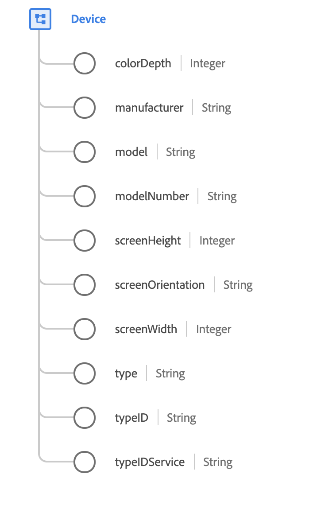

# [!UICONTROL Device] data type

[!UICONTROL Device] is a standard XDM data type that describes an identified device. A device is an application or browser instance that is trackable across sessions, normally by cookies.

 

| Property | Data type | Description |
| --- | --- | --- |
| `colorDepth` | Integer | The number of colors the display is able to represent. |
| `manufacturer` | String | The name of the organization who owns the design and creation of the device. |
| `model` | String | The name of the model for the device. This is the common, human-readable, or marketing name for the device. For example, the "iPhone 6S" is a particular model of mobile phone. |
| `modelNumber` | String | The unique model number designation assigned by the manufacturer for this device. Model numbers are not versions, but unique identifiers that identify a particular model configuration. |
| `screenHeight` | Integer | The number of vertical pixels of the device's active display in the default orientation. |
| `screenOrientation` | String | The current screen orientation. Accepted values include `portrait` and `landscape`. |
| `screenWidth` | String | The number of horizontal pixels of the device's active display in the default orientation. |
| `type` | String | The type of device being tracked. Accepted values include: <ul><li>`mobile`</li><li>`tablet`</li><li>`desktop`</li><li>`ereader`</li><li>`gaming`</li><li>`television`</li><li>`settop`</li><li>`mediaplayer`</li><li>`computers`</li><li>`tv screens`</li></ul>|
| `typeID` | String | An identifier for the device. This may be an identifier from DeviceAtlas or another service that identifies the hardware that is being used.|
| `typeIDService` | String | The namespace of the service that is used to identify the device type. See the [appendix](#typeIDService) for details on accepted values. |

{style="table-layout:auto"}

For more details on the field group, refer to the public XDM repository:

* [Populated example](https://github.com/adobe/xdm/blob/master/components/datatypes/device.example.1.json)
* [Full schema](https://github.com/adobe/xdm/blob/master/components/datatypes/device.schema.json)

## Appendix

The following section contains additional information about the [!UICONTROL Device] data type.

## Accepted values for typeIDService {#typeIDService}

The following table outlines the accepted values for `typeIDService` and their associated meanings:

| Value | Description |
| --- | --- |
| `https://ns.adobe.com/xdm/external/deviceatlas` | The device has been identified using DeviceAtlas. |
| `https://ns.adobe.com/xdm/external/adobecampaign` | The device has been identified using Adobe Campaign. |
