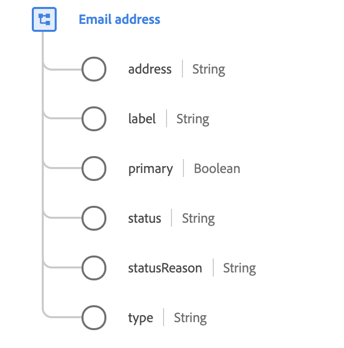

# [!UICONTROL Email address] data type

[!UICONTROL Email address] is a standard Experience Data Model (XDM) data type that describes the details of an email address.

 

| Property | Description |
| --- | --- |
| `address` | The technical address of the email as commonly defined in RFC2822 and subsequent standards (for example, `name@domain.com`).  In XDM, email addresses must contain a valid top-level domain in order to pass validation. Refer to the following [document](https://data.iana.org/TLD/tlds-alpha-by-domain.txt) for a full list of valid top-level domains as defined by the Internet Assigned Numbers Authority (IANA). |
| `label` | Additional display information that may be available. For example, if an email has a Microsoft Outlook rich address display of `John Smith smithjr@company.uk`, `John Smith` would be placed in this field. |
| `primary` | Indicates whether this is the individual's primary email address. A profile can have only one `primary` email address at a given point of time. |
| `status` | Indicates whether the email address can be currently used |
| `statusReason` | A description of the current `status`. |
| `type` | The way the account relates to the person (such as `work` or `personal`). |

{style="table-layout:auto"}

For more details on the email address data type, refer to the public XDM repository:

* [Populated example](https://github.com/adobe/xdm/blob/master/components/datatypes/demographic/emailaddress.example.1.json)
* [Full schema](https://github.com/adobe/xdm/blob/master/components/datatypes/demographic/emailaddress.schema.json)
