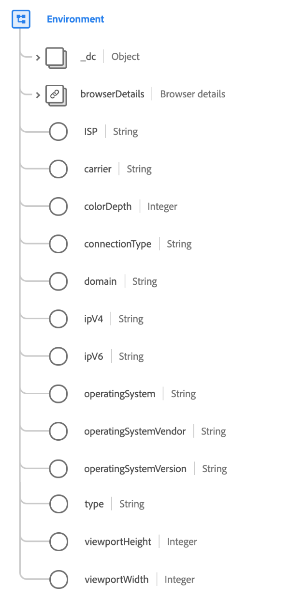

# [!UICONTROL Environment] data type

[!UICONTROL Environment] is a standard XDM data type that describes the surrounding environment of an observed event, specifically detailing transitory information such as network and software versions.

>[!IMPORTANT]
>
>All values should be aligned with the [DeviceAtlas](https://deviceatlas.com) database, licensed by Adobe.

 

| Property | Data type | Description |
| --- | --- | --- |
| `_dc` | Object | An object that contains a single field, `language`, which indicates the language of the environment to represent the user's linguistic, geographical, or cultural preferences for data presentation. Languages are specified in language code as defined in [IETF RFC 3066](https://www.ietf.org/rfc/rfc3066.txt). |
| `browserDetails` | [Browser details](./browser-details.md) | Describes the browser-specific details of the environment, such as browser name, version, JavaScript version, user agent string, and accept language. |
| `ISP` | String | The name of the user's internet service provider. |
| `carrier` | String | The name of the mobile network carrier or MNO (also known as a wireless service provider, wireless carrier, cellular company, or mobile network carrier) that sells and delivers communication services to to the user. |
| `colorDepth` | Integer | The number of bits used for each color component of a single pixel. |
| `connectionType` | String | The internet connection type. Accepted values include: <ul><li>`dialup`</li><li>`isdn`</li><li>`bisdn`</li><li>`dsl`</li><li>`cable`</li><li>`wireless_wifi`</li><li>`mobile`</li><li>`mobile_edge`</li><li>`mobile_2g`</li><li>`mobile_3g`</li><li>`mobile_lte`</li><li>`t1`</li><li>`t3`</li><li>`oc3`</li><li>`lan`</li><li>`modem`</li></ul> |
| `domain` | String | The domain of the user's ISP. |
| `ipV4` | String | The numerical label assigned to a device participating in a computer network that uses the Internet Protocol for communication (32-bit). |
| `ipV6` | String | The numerical label assigned to a device participating in a computer network that uses the Internet Protocol for communication (128-bit).  |
| `operatingSystem` | String | The name of the operating system used when the observation was made. The attribute should not contain any version information such as `10.5.3`, but instead contain "edition" designations such as `Ultimate` or `Professional`. |
| `operatingSystemVendor` | String | The name of the operating system vendor used when the observation was made. |
| `operatingSystemVersion` | String | The full version identifier for the operating system used when the observation was made. Versions are generally numerically composed but may be in a vendor-defined format. |
| `type` | String | The type of the application environment. See the [appendix](#type) for accepted values. |
| `viewportHeight` | Integer | The vertical size in pixels of the window the experience was displayed inside. For a web-view event, this is the browser viewport height. |
| `viewPortWidth` | Integer | The horizontal size in pixels of the window the experience was displayed inside. For a web-view event, this is the browser viewport width. |

{style="table-layout:auto"}

For more details on the data type, refer to the public XDM repository:

* [Populated example](https://github.com/adobe/xdm/blob/master/components/datatypes/environment.example.1.json)
* [Full schema](https://github.com/adobe/xdm/blob/master/components/datatypes/environment.schema.json)

## Appendix

The following section contains additional information about the [!UICONTROL Device] data type.

## Accepted values for type {#type}

The following table outlines the accepted values for `type` and their associated meanings:

| Value | Description |
| --- | --- |
| `browser` | Browser |
| `application` | Application |
| `iot` | Internet of things |
| `external` | External system |
| `widget` | Application extension |
