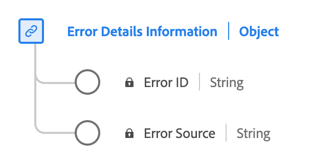

# [!UICONTROL Error Details Information] data type

[!UICONTROL Error Details Information] is a standard Experience Data Model (XDM) data type that describes error details. Use the [!UICONTROL Error Details Information] data type to capture details for the error source and identification. The error ID identifies the error and the error source specifies whether it originates from the player or an external source.

| Display name   | Property       | Data type | Description                                  |
|----------------|----------------|-----------|----------------------------------------------|
| [!UICONTROL Error ID]      | `name`       | string    | The error ID.                                |
| [!UICONTROL Error Source]   | `source`     | string    | The error source. Enumerated: "player", "external" with respective meanings.  |

{style="table-layout:auto"}

For more details on the field group, refer to the [public XDM repository](https://github.com/adobe/xdm/blob/master/components/datatypes/errordetails.schema.json)
