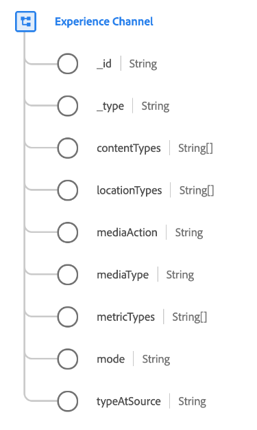

# [!UICONTROL Experience channel] data type

[!UICONTROL Experience channel] is a standard Experience Data Model (XDM) data type that describes an experience channel. An experience channel represents a method or path for how digital experiences are consumed.

There are multiple experience channels, each with different constraints on how content is delivered, and how customer interaction can be observed, and how data is collected. Within a channel, experiences can be delivered to specific locations. The locations and types of locations that exist in a channel differ from channel to channel.

| Property | Data type | Description |
| --- | --- | --- |
| `_id` | String | An ID that uniquely identifies the channel. Each specific experience channel defines a constant `@id`. |
| `_type` | String | Provides a rough classification label for channels with similar properties. |
| `contentTypes` | Array of strings | The content types that this channel can deliver. |
| `locationTypes` | Array of strings | The types of locations (virtual places) that this channel consists of and can deliver content to. |
| `mediaAction` | String | Describes an Experience Event media action, if applicable. |
| `mediaType` | String | Describes whether the media type is paid,owned or earned. |
| `metricTypes` | Array of strings | The metrics that can be collected in this channel. |
| `mode` | String | How experiences are delivered in this channel. |
| `typeAtSource` | String | A custom name for the channel. |

{style="table-layout:auto"}

For more details on the data type, refer to the public XDM repository:

* [Populated example](https://github.com/adobe/xdm/blob/master/components/datatypes/channels/channel.example.1.json)
* [Full schema](https://github.com/adobe/xdm/blob/master/components/datatypes/channels/channel.schema.json)
