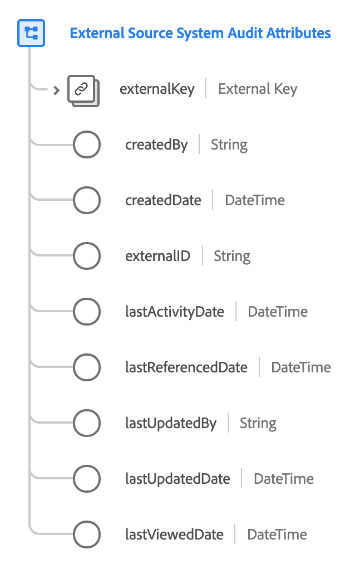

# [!UICONTROL External Source System Audit Attributes] data type

[!UICONTROL External Source System Audit Attributes] is a standard Experience Data Model (XDM) data type that captures audit details about an external source system.

| Property | Data type | Description |
| --- | --- | --- |
| `externalKey` | [[!UICONTROL B2B Source]](./b2b-source.md) | A composite identifier for the source used for auditing. |
| `createdBy` | String | The name of the user who created this record. |
| `createdDate` | DateTime | The date when this record was created. |
| `externalID` | String | External unique identifier for the source. This value is used to help identify and deduplicate if needed. |
| `lastActivityDate` | DateTime | The last activity date for the source system. |
| `lastReferencedDate` | DateTime | The last referenced date for the source system. |
| `lastUpdatedBy` | String | The name of the person who last updated this record. |
| `lastUpdatedDate` | DateTime | The last updated date for the source system. |
| `lastViewedDate` | DateTime | The last viewed date for the source system. |

{style="table-layout:auto"}

For more details on the data type, refer to the public XDM repository:

* [Populated example](https://github.com/adobe/xdm/blob/master/components/datatypes/auditing/external-source-system-audit.example.1.json)
* [Full schema](https://github.com/adobe/xdm/blob/master/components/datatypes/auditing/external-source-system-audit.schema.json)
