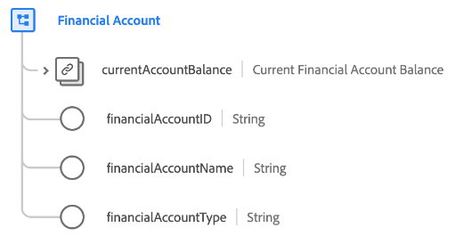

# [!UICONTROL Financial Account] data type

[!UICONTROL Financial Account] is a standard XDM data type that describes the details of a financial account including its type, owner, and current balance.

| Property | Data type | Description |
| --- | --- | --- |
| `currentAccountBalance` | [[!UICONTROL Currency]](./currency.md) | The current balance of the account. |
| `financialAccountId` | [!UICONTROL String] | A unique ID for the account. |
| `financialAccountName` | [!UICONTROL String] | The name assigned to the account. |
| `financialAccountType` | [!UICONTROL String] | The type of financial account, such as checking, savings, or retirement. |

{style="table-layout:auto"}

For more details on the data type, refer to the [public XDM repository](https://github.com/adobe/xdm/blob/master/docs/reference/datatypes/financial-account.schema.json).
