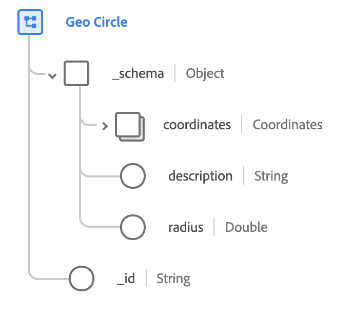

# [!UICONTROL Geo Circle] data type

[!UICONTROL Geo Circle] is a standard XDM data type that describes circular geographic region, given a particular radius centered on a specific set of coordinates. This data type is based on the public specification documented on [schema.org](https://schema.org/GeoCircle).

 

| Property | Data type | Description |
| --- | --- | --- |
| `_schema.coordinates` | [[!UICONTROL Geo Coordinates]](./geo-coordinates.md) | Describes the geographic coordinates of the center of the circle. |
| `_schema.description` | String | A description of what the circle contains. |
| `_schema.radius` | Double | The length of the radius of the circle. This value conforms to the [WGS84](https://gisgeography.com/wgs84-world-geodetic-system/) datum and is measured in meters. |
| `_id` | String | A unique, system-generated ID for the circle. |
