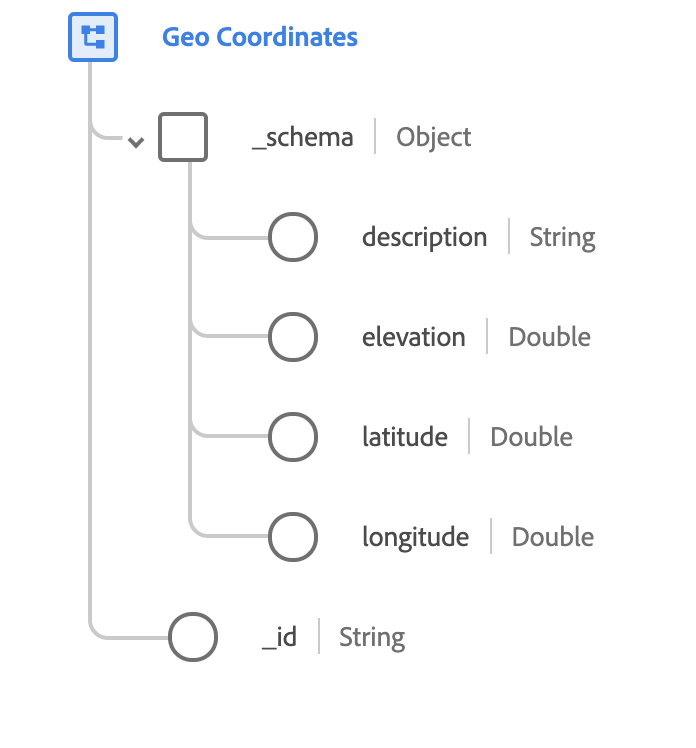

# [!UICONTROL Geo Coordinates] data type

[!UICONTROL Geo Coordinates] is a standard XDM data type that describes the geographic coordinates of a place. This data type is based on the public spec documented on [schema.org](https://schema.org/GeoCoordinates).

 

| Property | Data type | Description |
| --- | --- | --- |
| `_schema.description` | String | A description of what the coordinates identify. |
| `_schema.elevation` | Double | The specific elevation of the defined coordinate. The value must conform to the [WGS84](http://gisgeography.com/wgs84-world-geodetic-system/) datum and is measured in meters. |
| `_schema.latitude` | Double | The signed vertical coordinate of the geographic point. |
| `_schema.longitude` | Double | The signed horizontal coordinate of the geographic point. |
|  `_id` | String | A unique, system-generated ID for the coordinates. |
