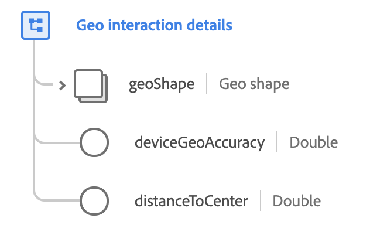

# [!UICONTROL Geo interaction details] data type

[!UICONTROL Geo interaction details] is a standard XDM data type that describes the current state of inclusion in a geographically defined area.

 

| Property | Data type | Description |
| --- | --- | --- |
| `geoShape` | [[!UICONTROL Geo Shape]](./geo-shape.md) | Describes the geo shape of the area being interacted with. This field can describe a box, a circle, or a polygon. |
| `deviceGeoAccuracy` | Double | The accuracy of the geo measuring device or mechanism, measured in meters. |
| `distanceToCenter` | Double | The distance to the center of geo in the case of a geo circle, measured in meters. |

{style="table-layout:auto"}

For more details on the data type, refer to the public XDM repository:

* [Populated example](https://github.com/adobe/xdm/blob/master/components/datatypes/geo-interaction-details.example.1.json)
* [Full schema](https://github.com/adobe/xdm/blob/master/components/datatypes/geo-interaction-details.schema.json)
