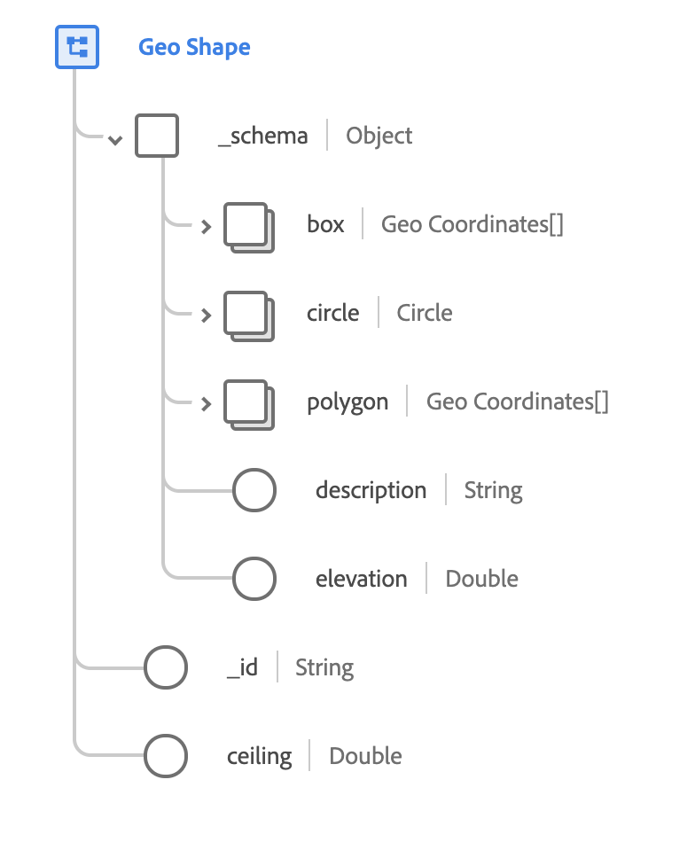

# [!UICONTROL Geo Shape] data type

[!UICONTROL Geo Shape] is a standard XDM data type that describes the shape of a geographic area. This data type is based on the public specification documented on [schema.org](https://schema.org/GeoShape).

 

| Property | Data type | Description |
| --- | --- | --- |
| `_schema.box` | Array of [[!UICONTROL Geo Coordinates]](./geo-coordinates.md) | Describes a geographical area enclosed by a rectangle formed by two coordinates. The first coordinate is the lower corner of the rectangle, and the second coordinate is the upper corner. |
| `_schema.circle` | Array of [[!UICONTROL Geo Coordinates]](./geo-coordinates.md) | Describes a circular region with a specific radius centered on a geographic coordinate. |
| `_schema.polygon` | [[!UICONTROL Geo Circle]](./geo-circle.md) | A series of four or more coordinates where the first and final coordinates are identical. |
| `_schema.description` | String | A description of what the shape is defining. |
| `_schema.elevation` | Double | The specific or minimum elevation of the shape. This value conforms to the [WGS84](https://gisgeography.com/wgs84-world-geodetic-system/) datum and is measured in meters. In combination with `ceiling`, this property can be used to express a three-dimensional bounding box for a location. |
| `_id` | String | A unique, system-generated identifier for the shape. |
| `ceiling` | Double | The maximum elevation of the shape. This property is only valid when used in combination with `elevation`. The value conforms to the [WGS84](https://gisgeography.com/wgs84-world-geodetic-system/) datum and is measured in meters. In combination with `elevation`, this property can be used to express a three-dimensional bounding box for a location. |
