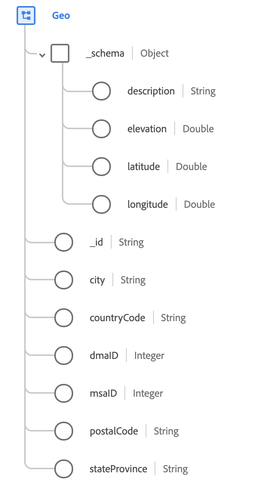

# [!UICONTROL Geo] data type

[!UICONTROL Geo] is a standard XDM data type that describes the geographic area where an event was observed.

 

| Property | Data type | Description |
| --- | --- | --- |
| `_schema` | [[!UICONTROL Geo Coordinates]](./geo-coordinates.md) | Describes the geographic coordinates of a place. |
| `_id` | String | A unique, system-generated ID for the coordinates. |
| `city` | String | The name of the city. |
| `countryCode` | String | The two-character <a href="https://datahub.io/core/country-list">ISO 3166-1 alpha-2</a> code for the country. |
| `dmaID` | Integer | The Nielsen media research designated market area. |
| `msaID` | Integer | The metropolitan statistical area in the United States where the observation occurred. |
| `postalCode` | String | The postal code of the location. Postal codes are not available for all countries. In some countries, this will only contain part of the postal code. |
| `stateProvince` | String | The state, or province portion of the observation. The format follows the [ISO 3166-2 (country and subdivision)](https://www.unece.org/cefact/locode/subdivisions.html) standard. |

{style="table-layout:auto"}

For more details on the data type, refer to the public XDM repository:

* [Populated example](https://github.com/adobe/xdm/blob/master/components/datatypes/demographic/geo.example.1.json)
* [Full schema](https://github.com/adobe/xdm/blob/master/components/datatypes/demographic/geo.schema.json)
