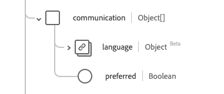

# [!UICONTROL Person] data type

[!UICONTROL Person] is a standard Experience Data Model (XDM) data type that provides information on a generic person record. This data type is created as per HL7 FHIR Release 5 specifications.

| Display Name | Property | Data type | Description |
| --- | --- | --- | --- |
| [!UICONTROL Address] | `address` | Array of [[!UICONTROL Address]](../healthcare/address.md) | One or more addresses for the person. |
| [!UICONTROL Communication] | `communication` | Array of objects | A language which may be used to communicate with the person about his or her health. See the [section below](#communication) for more information. |
| [!UICONTROL Identifier] | `identifier` | Array of [[!UICONTROL Identifier]](../healthcare/identifier.md) | A human identifier for this person. |
| [!UICONTROL Person Link Details] | `link` | Array of objects | A link to a resource that concerns the same actual person. See the [section below](#link) for more information. |
| [!UICONTROL Managing Organization] | `managingOrganization` | [[!UICONTROL Reference]](../healthcare/reference.md) | The organization that is the custodian of the patient record. |
| [!UICONTROL Marital Status] | `maritalStatus` | [[!UICONTROL Codeable Concept]](../healthcare/codeable-concept.md) | The marital (or civil) status of a person |
| [!UICONTROL Name] | `name` | Array of [[!UICONTROL Human Name]](../healthcare/human-name.md) | The names associated with a person. |
| [!UICONTROL Contact Details] | `telecom` | Array of [[!UICONTROL Contact Point]] | The contact details by which the person may be contacted. |
| [!UICONTROL Is Active] | `active` | Boolean | Indicates whether the person's record is in active use. |
| [!UICONTROL Birth Date] | `birthDate` | Date | The date of birth for the person. |
| [!UICONTROL Deceased Indicator] | `deceasedBoolean` | Boolean | Indicates if the person is deceased or not. |
| [!UICONTROL Deceased Date Time] | `deceasedDateTime` | DateTime | The date and time of death if the person is deceased. |
| [!UICONTROL Gender] | `gender` | String | The gender identity of the person. The value of this property must be equal to one of the following known enum values. <li> `female` </li> <li> `male` </li> <li> `other` </li> <li> `unknown`</li>  |

For more details on the data type, refer to the public XDM repository:

* [Populated example](https://github.com/adobe/xdm/blob/master/extensions/industry/healthcare/fhir/datatypes/identifier.example.1.json)
* [Full schema](https://github.com/adobe/xdm/blob/master/extensions/industry/healthcare/fhir/datatypes/identifier.schema.json)

## `communication` {#communication}

`communication` is provided as an array of objects. The structure of each object is described below.

| Display Name | Property | Data type | Description |
| --- | --- | --- | --- |
| [!UICONTROL Language] | `language` | [[!UICONTROL Codeable concept]](../../data-types/healthcare/codeable-concept.md) | The language which can be used to communicate with the person about his or her health. |
| [!UICONTROL Is Preferred Language] | `preferred`| Boolean | Indicates if the language is their preferred language or not. |

## `link` {#link}

`link` is provided as an array of objects. The structure of each object is described below.

| Display Name | Property | Data type | Description |
| --- | --- | --- | --- |
| [!UICONTROL Target] | `target` | [[!UICONTROL Reference]](../../data-types/healthcare/reference.md) | The resource to which this actual person is associated. |
| [!UICONTROL Assurance] | `assurance` | String | The level of assurance associated with the link. The values of this property must be equal to one or more of the following known enum values. <li> `level1` </li> <li> `level2` </li> <li> `level3` </li> <li> `level4` </li> |
