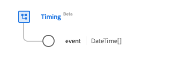

# [!UICONTROL Timing] data type

[!UICONTROL Timing] is a standard Experience Data Model (XDM) data type that describes a timing schedule that provides information on an event that may occur multiple times. This data type is created as per the HL7 FHIR Release 5 specifications.

<!-- This screenshot will need to be updated once the UI bug hiding the repeat and code fields is fixed. -->

| Display Name | Property | Data type | Description |
| --- | --- | --- | --- |
| [!UICONTROL Event] | `event` | Array of DateTime | When the event occurs. |
| [!UICONTROL Repeat] | `repeat` | [[!UICONTROL Repeat]](../healthcare/repeat.md) | Information about when the event occurs. |
| [!UICONTROL Code] | `code` | [[!UICONTROL Codeable Concept]](../healthcare/codeable-concept.md) | The code relating to the event. |

For more details on the data type, refer to the public XDM repository:

* [Populated example](https://github.com/adobe/xdm/blob/master/extensions/industry/healthcare/fhir/datatypes/timing.example.1.json)
* [Full schema](https://github.com/adobe/xdm/blob/master/extensions/industry/healthcare/fhir/datatypes/timing.schema.json)
