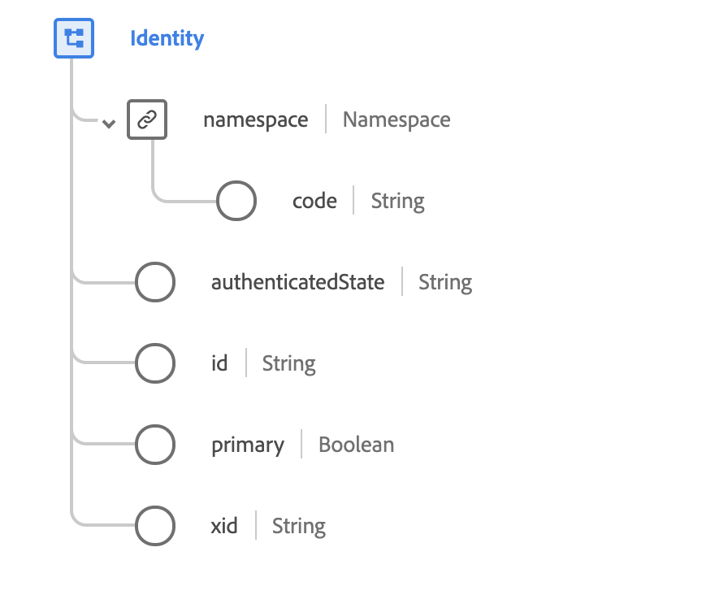

# [!UICONTROL Identity] data type

[!UICONTROL Identity] is a standard XDM data type that is used to clearly distinguish people that are interacting with digital experiences. Identity is established by an identity provider, which itself is referenced in a `namespace` attribute. Within each `namespace`, the identity is unique.

 

| Property | Data type | Description |
| --- | --- | --- |
| `namespace` | Object | An object that contains a single string field (`code`), which indicates the namespace associated with the provided `id` attribute. |
| `authenticatedState` | String | The authenticated state for this identity at the time of the observed Experience Event. See the [appendix](#authenticatedState) for accepted values and definitions. |
| `id` | String | The identity of the consumer in the related namespace. |
| `primary` | Boolean | Indicates whether this is the primary identity for the individual. Each individual can only have one primary identity. |
| `xid` | String | When present, this value represents a cross-namespace identifier that is unique across all namespace-scoped identifiers in all namespaces. |

{style="table-layout:auto"}

For more details on the data type, refer to the public XDM repository:

* [Populated example](https://github.com/adobe/xdm/blob/master/components/datatypes/identity.example.1.json)
* [Full schema](https://github.com/adobe/xdm/blob/master/components/datatypes/identity.schema.json)

## Appendix

The following section contains additional information about the [!UICONTROL Identity] data type.

## Accepted values for authenticatedState {#authenticatedState}

The following table outlines the accepted values for `authenticatedState` and their associated meanings:

| Value | Description |
| --- | --- |
| `ambiguous` | The authenticated state is ambiguous. |
| `authenticated` | The user was identified by a login or similar action that was valid at the time of the event observation. |
| `loggedOut` | The user was identified by a login action at some previous point in time, but was not logged in at the time of the event observation. |
