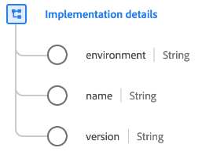

# [!UICONTROL Implementation details] data type

[!UICONTROL Implementation details] is a standard Experience Data Model (XDM) data type that describes a technology implementation, such as an API or an SDK.

| Property | Data type | Description |
| --- | --- | --- |
| `environment` | String | The environment of the implementation. |
| `name` | String | The identifier for the SDK or endpoint. All SDKs or endpoints are identified through a URI, including extensions. |
| `version` | String | The version of the API or SDK. |

{style="table-layout:auto"}

For more details on the data type, refer to the public XDM repository:

* [Populated example](https://github.com/adobe/xdm/blob/master/components/datatypes/industry-verticals/implementationdetails.example.1.json)
* [Full schema](https://github.com/adobe/xdm/blob/master/components/datatypes/industry-verticals/implementationdetails.schema.json)
