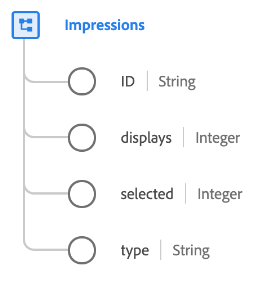

# [!UICONTROL Impressions] data type

[!UICONTROL Impressions] is a standard XDM data type that describes a marketing impression, which is a metric used to quantify the number of digital views or engagements for a piece of content such as an advertisement, digital post, or web page.

| Property | Data type | Description |
| --- | --- | --- |
| `ID` | String | A unique ID for the impression. |
| `displays` | Integer | The number of times the impression item has been displayed to a customer. |
| `selected` | Integer | The number of times the impression item has been selected or clicked. |
| `type` | String | The type of impression. |

{style="table-layout:auto"}

For more details on the field group, refer to the public XDM repository:

* [Populated example](https://github.com/adobe/xdm/blob/master/components/datatypes/industry-verticals/impressions.example.1.json)
* [Full schema](https://github.com/adobe/xdm/blob/master/components/datatypes/industry-verticals/impressions.schema.json)
