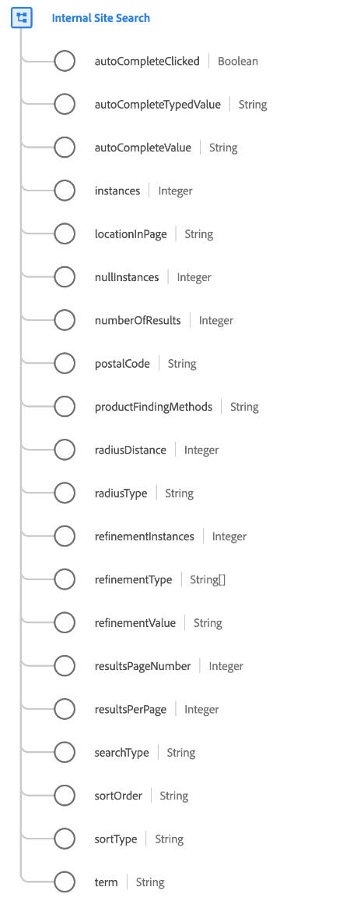

# [!UICONTROL Internal Site Search] data type

[!UICONTROL Internal Site Search] is a standard XDM data type that describes an internal site search, including all related search behaviors and details.

| Property | Data type | Description |
| --- | --- | --- |
| `autoCompleteClicked` | [!UICONTROL Boolean] | Indicates whether a visitor used a suggested or autocompleted search value to execute the search. |
| `autoCompleteTypedValue` | [!UICONTROL String] | For autocomplete scenarios, users sometimes abandon their search and select a specific term from the dropdown. This value tracks what the user started to type in order to generate the specific set of suggested search terms. |
| `autoCompleteValue` | [!UICONTROL String] | For autocomplete scenarios, users sometimes abandon their search and select a specific term from the dropdown menu. This value is used to track the specific terms selected. |
| `instances` | [!UICONTROL Integer] | The number of times the internal site search occurred. |
| `locationInPage` | [!UICONTROL String] | When multiple search boxes exist on the page, this value should be used to identify the specific location the user used to search. |
| `nullInstances` | [!UICONTROL Integer] | The number of times the internal site search occurred that provided zero results. |
| `numberOfResults` | [!UICONTROL Integer] | The total number of search results returned. |
| `postalCode` | [!UICONTROL String] | The postal code used for the search, if applicable. |
| `productFindingMethods` | [!UICONTROL String] | The internal site search term value with merchandising binding. This value indicates what term was searched for immediately before viewing a product. |
| `radiusDistance` | [!UICONTROL Integer] | Combined with `radiusType`, indicates the selected distance of the search radius. |
| `radiusType` | [!UICONTROL Integer] | The selected distance type of `radiusDistance`, either miles or kilometers. |
| `refinementInstances` | [!UICONTROL Integer] | The number of times the internal site search was refined. |
| `refinementType` | Array of strings | Lists the refinement types applied to the search results. Examples include department, brand, price, in-store, review rating, color, material, and so on. |
| `refinementValue` | [!UICONTROL String] | The value that the search was refined to. |
| `resultsPageNumber` | [!UICONTROL Integer] | For paginated search results, this value tracks the page of results the visitor is viewing. |
| `resultsPerPage` | [!UICONTROL Integer] | For paginated search results, this value tracks the number of search results displayed per page. |
| `searchType` | [!UICONTROL String] | Captures the method of search being executed, if applicable. Examples could include a type-ahead search, directly typed search, or any other type of custom search functionality a site might have. |
| `sortOrder` | [!UICONTROL String] | Combined with `sortType`, indicates the sort order of the search results, either ascending or descending. |
| `term` | [!UICONTROL String] | The internal site search term entered by the visitor. |

{style="table-layout:auto"}

For more details on the data type, refer to the [public XDM repository](https://github.com/adobe/xdm/blob/master/docs/reference/datatypes/internal-site-search.schema.json).
