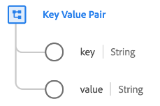

# [!UICONTROL Key Value Pair] data type

[!UICONTROL Key Value Pair] is a standard Experience Data Model (XDM) data type that captures the details of a generic key-value pair. This data type is used in the [[!UICONTROL Adobe Analytics ExperienceEvent Full Extension] field group](../field-groups/event/analytics-full-extension.md) to describe the array items of a list variable.

| Property | Data type | Description |
| --- | --- | --- |
| `key` | String | A key (name) for a generic variable or value. |
| `value` | String | The value of the variable. |

{style="table-layout:auto"}

For more details on the data type, refer to [the public XDM repository](https://github.com/adobe/xdm/blob/master/extensions/adobe/experience/analytics/keyvalue.schema.json).
