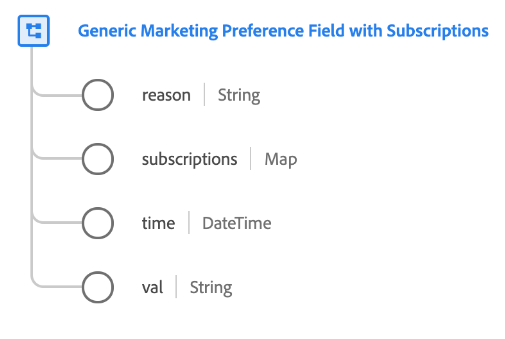

# [!UICONTROL Generic Marketing Preference Field with Subscriptions] data type

[!UICONTROL Generic Marketing Preference Field with Subscriptions] is a standard XDM data type that describes a customer's selection for a particular marketing preference.

>[!NOTE]
>
>This data type is intended to be used to customize the structure of your organization's consent schemas using the [[!UICONTROL Privacy/Personalization/Marketing Preferences (Consents)] mixin](../mixins/profile/consents.md) as a baseline.
>
>If you do not require a `subscriptions` map for a particular marketing preference field, you can use the [basic marketing field data type](./marketing-field.md) instead.



| Property | Data type | Description |
| --- | --- | --- |
| `reason` | String | When a customer opts out of a marketing use case, this string field represents the reason why the customer opted out. |
| `subscriptions` | Map | A map of customer marketing preferences for specific subscriptions. See the section on [subscriptions](#subscriptions) for more information. |
| `time` | DateTime | An ISO 8601 timestamp of when the marketing preference changed, if applicable. |
| `val` | String | The customer-provided preference choice for this marketing use case. See the [next section](#val) for accepted values and definitions. |

## `val` {#val}

The following table outlines the accepted values for `val`:

| Value | Title|  Description |
| --- | --- | --- |
| `y` | Yes | The customer has opted in for the preference. In other words, they **do** consent to the use of their data as indicated by the preference in question. |
| `n` | No | The customer has opted out of the preference. In other words, they **do not** consent to the use of their data as indicated by the preference in question. |
| `p` | Pending verification  | The system has not yet received a final preference value. This is most often used as part of a consent that requires two-step verification. For example, if a customer opts into receiving emails, that consent is set to `p` until they select a link in an email to verify that they have provided the correct email address, at which point the consent would be updated to `y`.<br><br>If this preference does not use a two-set verification process, then the `p` choice may instead be used to indicate that the customer has not yet responded to the consent prompt. For example, you can automatically set the value to `p` on the first page of a website, before the customer has responded to the consent prompt. In jurisdictions that do not require explicit consent, you may also use it to indicate that the customer has not explicitly opted out (in other words, consent is assumed). |
| `u` | Unknown | The customer's preference information is unknown. |
| `LI` | Legitimate Interest | The legitimate business interest to collect and process this data for the specified purpose outweighs the potential harm it poses to the individual. |
| `CT` | Contract | The collection of data for the specified purpose is required to meet contractual obligations with the individual. |
| `CP` | Compliance with a Legal Obligation | The collection of data for the specified purpose is required to meet the legal obligations of the business. |
| `VI` | Vital Interest of the Individual | The collection of data for the specified purpose is required to protect the vital interests of the individual. |
| `PI` | Public Interest | The collection of data for the specified purpose is required to carry out a task in the public interest or in the exercise of official authority. |

## `subscriptions` {#subscriptions}

Some businesses allow customers to opt in for different subscriptions that are associated with a particular marketing channel. For example, a banking company may allow customers to subscribe to phone alerts for overdrawn accounts, or receive sales calls for loyalty program offers.

The following JSON represents an example marketing field for a phone call marketing channel that contains a `subscriptions` map. Each key in the `subscriptions` object represents an individual subscription for the marketing channel. In turn, each subscription contains an opt-in value (`val`).

```json
"phone-marketing-field": {
  "val": "y",
  "time": "2019-01-01T15:52:25+00:00",
  "subscriptions": {
    "loyalty-offers": {
      "val": "y",
      "type": "sales",
      "subscribers": {
        "123-555-0928": {
          "time": "2019-01-01T15:52:25+00:00",
          "source": "website"
        }
      }
    },
    "overdrawn-account": {
      "val": "y",
      "type": "issues",
      "subscribers": {
        "123-555-0928": {
          "time": "2021-01-01T08:32:53+07:00",
          "source": "website"
        },
        "301-555-1527": {
          "time": "2020-02-03T07:54:21+07:00",
          "source": "call center"
        }
      }
    }
  }
}
```

| Property | Description |
| --- | --- |
| `type` | The subscription type. This can be any descriptive string, provided it is 15 characters or less. |
| `subscribers` | An optional map-type field that represents a set of identifiers (such as email addresses or phone numbers) that have subscribed to a particular subscription. Each key in this object represents the identifier in question, and contains two sub-properties: <ul><li>`time`: An ISO 8601 timestamp of when the identity subscribed, if applicable.</li><li>`source`: The source that the subscriber originated from. This can be any descriptive string, provided it is 15 characters or less.</li></ul> |

## Additional resources

For more details on the data type, refer to the public XDM repository:

* [Populated example](https://github.com/adobe/xdm/blob/master/components/datatypes/consent/marketing-field-basic.example.1.json)
* [Full schema](https://github.com/adobe/xdm/blob/master/components/datatypes/consent/marketing-field-basic.schema.json)
