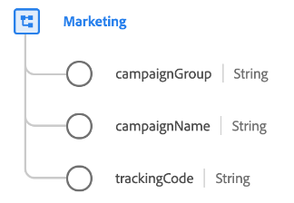

# [!UICONTROL Marketing] data type

[!UICONTROL Marketing] is a standard XDM data type that describes marketing activities that are active with a particular touchpoint.

| Property | Data type | Description |
| --- | --- | --- |
| `campaignGroup` | String | The name of the campaign group (in cases where multiple campaigns are grouped together like `50%_DISCOUNT`). |
| `campaignName` | String | The name of the marketing campaign, such as `50%_DISCOUNT_USA` or `50%_DISCOUNT_ASIA`. |
| `trackingCode` | String | The tracking code that can be used to identify the marketing campaign the event is associated with. |

{style="table-layout:auto"}

For more details on the field group, refer to the public XDM repository:

* [Populated example](https://github.com/adobe/xdm/blob/master/components/datatypes/marketing/marketing.example.1.json)
* [Full schema](https://github.com/adobe/xdm/blob/master/components/datatypes/marketing/marketing.schema.json)
