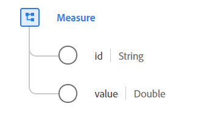

# [!UICONTROL Measure] data type

[!UICONTROL Measure] is a standard Experience Data Model (XDM) data type that contains a concrete quantifiable data point of a particular metric. A measure is composed of a unique identifier and a value.

{width=500}

| Property | Data type | Description |
| --- | --- | --- |
| `id` | String | The unique identifier of this measure. In cases of data collection using lossy communication channels, such as mobile apps or websites with offline functionality where transmission of measures cannot be ensured, this property contains a client-generated, unique ID of the measure taken. It is best practice to make this sufficiently long to ensure enough randomness.    If information such as timestamp, device ID, IP, MAC address, or other potentially user-identifying values are incorporated in the generation of the `id`, the result should be hashed. This ensures that no PII is encoded in the value, as the goal is not to identify a user or device, but the specific measure in time. |
| `value` | Double | The quantifiable value of this measure. |

{style="table-layout:auto"}

For more details on the data type, refer to the public XDM repository:

* [Populated example](https://github.com/adobe/xdm/blob/master/components/datatypes/data/measure.example.1.json)
* [Full schema](https://github.com/adobe/xdm/blob/master/components/datatypes/data/measure.schema.json)
