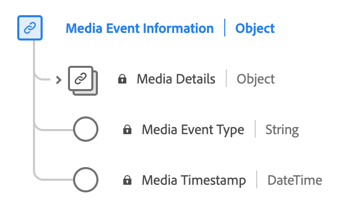

# [!UICONTROL Media Event Information] data type

[!UICONTROL Media Event Information] is a standard Experience Data Model (XDM) data type that describes media details information related to the experience event. 

| Property | Data type | Description |
| --- | --- | --- |
| `mediaCollection` | [!UICONTROL mediaDetails] | Media details information related to the experience event. This data type is used for both [media data collection](./media-collection-details.md) and [media data reporting](./media-reporting-details.md). |
| `mediaEventTimestamp` | [!UICONTROL String] | The time when a media event occurred. |
| `mediaEventType` | [!UICONTROL String] | The media event type. |

{style="table-layout:auto"}

For more details on the field group, refer to the [public XDM repository](https://github.com/adobe/xdm/blob/master/components/datatypes/mediaevent.schema.json)
