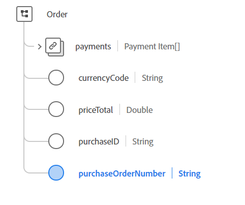

# [!UICONTROL Order] data type

[!UICONTROL Order] is a standard Experience Data Model (XDM) data type that describes the order placed for a product list.

 

| Property | Data type | Description |
| --- | --- | --- |
| `payments` | Array of [[!UICONTROL Payment Items]](./payment-item.md) | The list of payments for this order. |
| `currencyCode` | String | The ISO 4217 currency code used for the order totals. All instances must conform to the regular expression `^[A-Z]{3}$`. Examples include `USD` and `EUR`.  |
| `priceTotal` | Double | The total price of this order after all discounts and taxes have been applied. |
| `purchaseID` | String | A unique identifier assigned by the seller for this purchase or contract. Because this is defined by the seller, there is no guarantee that the ID is unique. |
| `purchaseOrderNumber` | String | The unique identifier assigned by the purchaser for this purchase or contract. |

{style="table-layout:auto"}

For more details on the data type, refer to the public XDM repository:

* [Populated example](https://github.com/adobe/xdm/blob/master/components/datatypes/data/order.example.1.json)
* [Full schema](https://github.com/adobe/xdm/blob/master/components/datatypes/data/order.schema.json)
