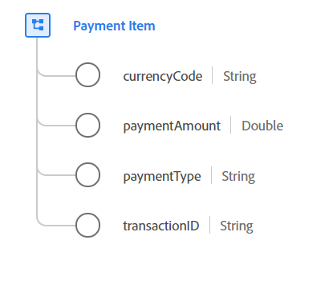

# [!UICONTROL Payment Item] data type

[!UICONTROL Payment Item] is a standard Experience Data Model (XDM) data type that describes a payment associated with an order that defines the type of payment, the amount, and the associated currency.

 

| Property | Data type | Description |
| --- | --- | --- |
| `currencyCode` | String | The ISO 4217 currency code used for the order totals. All instances must conform to the regular expression `^[A-Z]{3}$`. Examples include `USD` and `EUR`. |
| `paymentAmount` | Double | The value of the payment. |
| `paymentType` | String | The method of payment for this order. Accepted enum values include: <li> `cash` </li> <li> `credit_card` </li> <li> `debit_card` </li> <li> `gift_card` </li> <li> `check` </li> <li> `paypal` </li> <li> `wire_transfer` </li> <li> `credit_card_reference` </li> <li> `other` </li> |
| `transactionID` | String | The unique transaction identifier for this payment item. |

{style="table-layout:auto"}

For more details on the data type, refer to the public XDM repository:

* [Populated example](https://github.com/adobe/xdm/blob/master/components/datatypes/data/paymentitem.example.1.json)
* [Full schema](https://github.com/adobe/xdm/blob/master/components/datatypes/data/paymentitem.schema.json)
