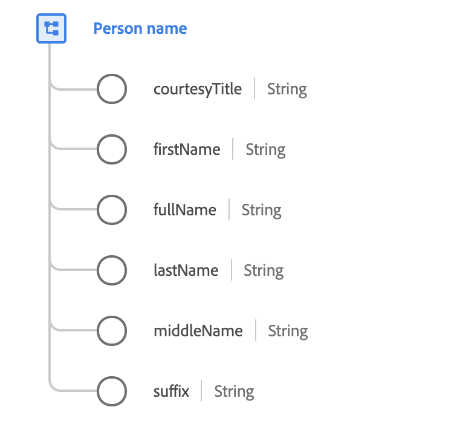

# [!UICONTROL Person name] data type

[!UICONTROL Person name] is a standard XDM data type that describes the full name of a person. As conventions for name structures differ widely across languages and cultures, names should always be modeled using this datatype.

In addition, the datatype provides a number of optional properties that can be used in situations that require using only a fragment of the full name, such as creating a formal or informal greeting.

 

| Property | Description |
| --- | --- |
| `courtesyTitle` | An abbreviation of a person's title, honorific, or salutation (such as `Mr.`, `Miss.`, or `Dr.`). |
| `firstName` | The first segment of the name in the writing order most commonly accepted in the language of the name. |
| `fullName` | The full name of the person, in the writing order most commonly accepted in the language of the name. |
| `lastName` | The last segment of the name in the writing order most commonly accepted in the language of the name. |
| `middleName` | Middle, alternative, or additional names supplied between the first name and last name. |
| `suffix` | A group of letters provided after a person's name to provide additional information (such as `Jr.`, `Sr.`, `M.D.`, `PhD`, `I`, `II`, `III`, and so on). |

For more details on the person name data type, refer to the public XDM repository:
* [Populated example](https://github.com/adobe/xdm/blob/master/components/datatypes/person-name.example.1.json)
* [Full schema](https://github.com/adobe/xdm/blob/master/components/datatypes/person-name.schema.json)